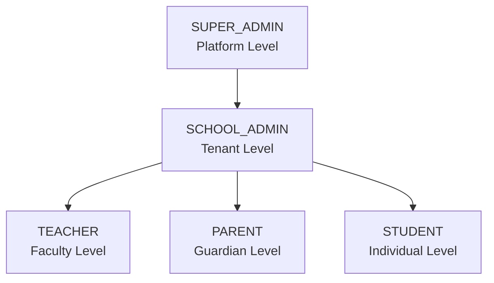
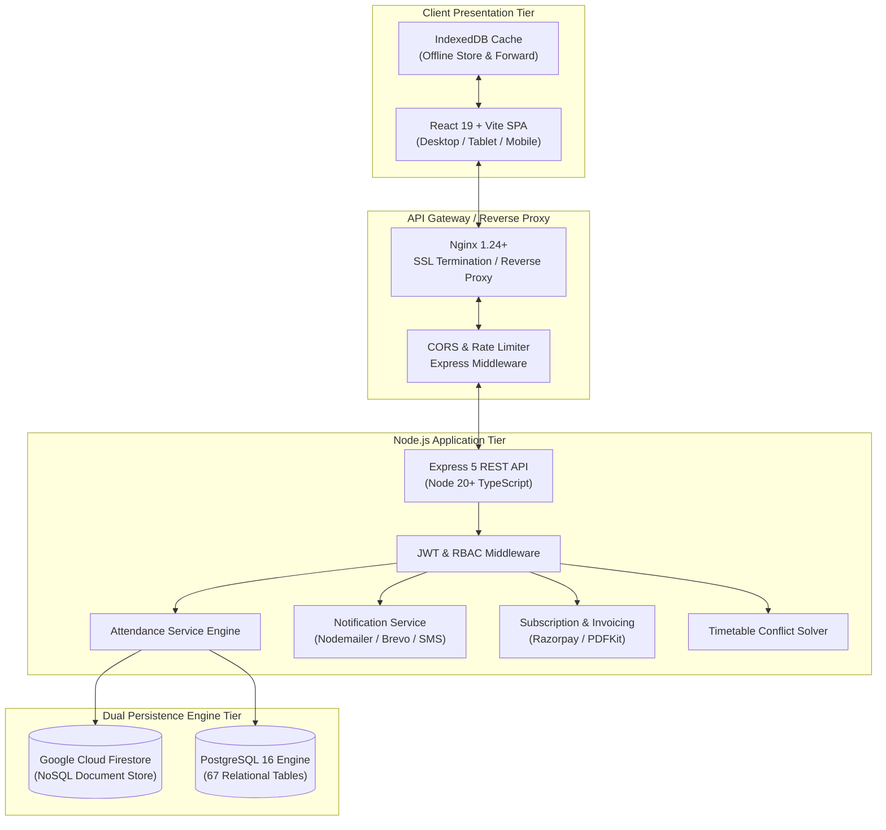
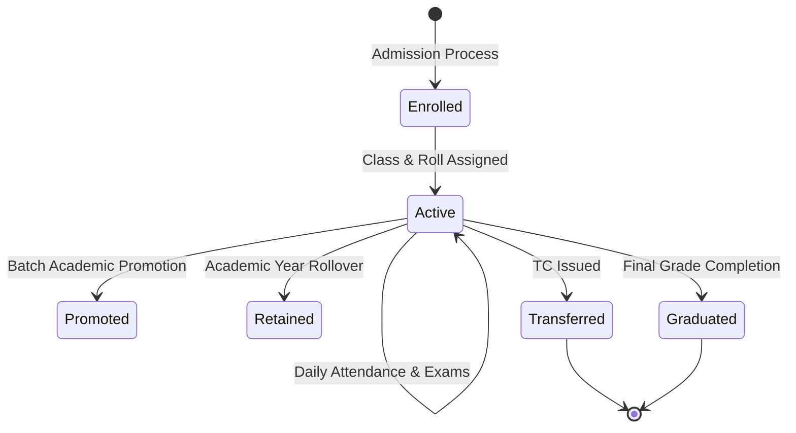
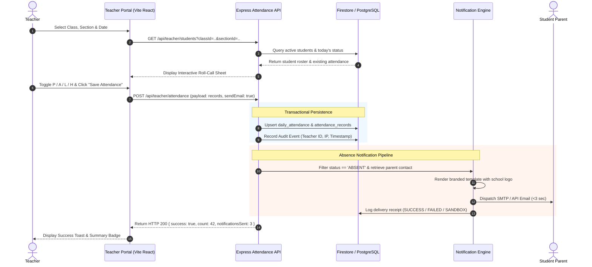
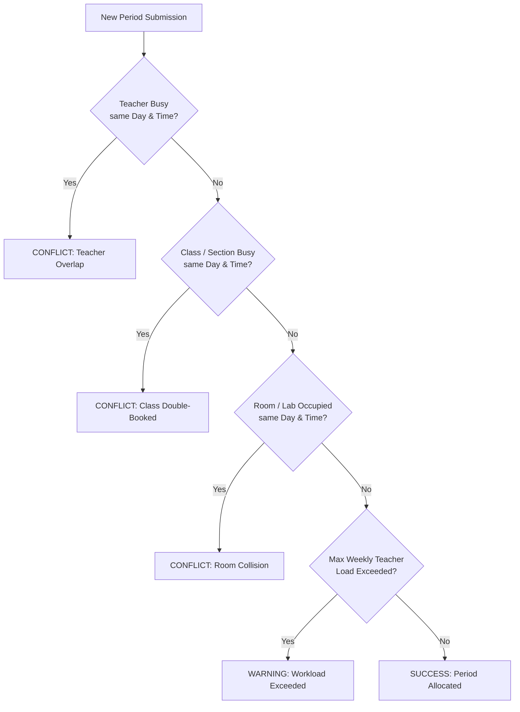
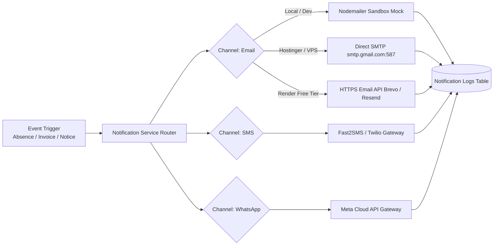
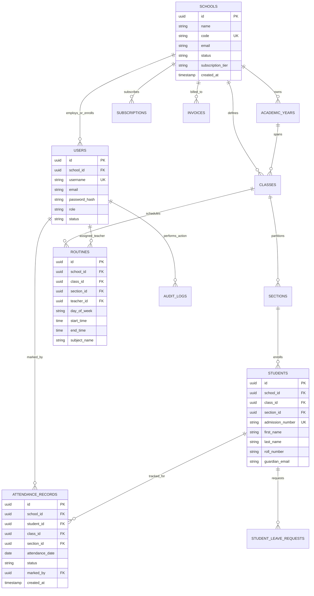
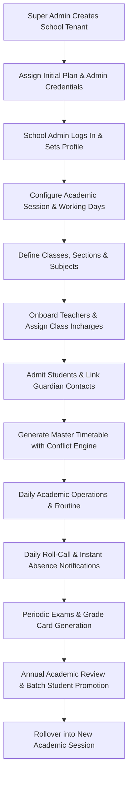
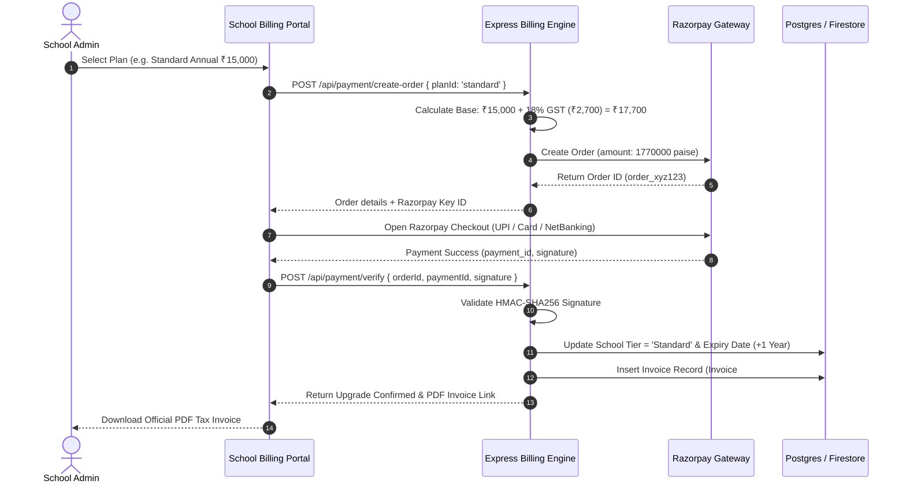

# AttendO School — Software Requirements Specification (SRS)
## Enterprise-Grade Technical & Functional Specification

---

### Document Control
- **Document Title**: Software Requirements Specification (SRS) for AttendO School Platform
- **Product Name**: AttendO School (`school-attendance-saas`)
- **System Version**: 0.11.0 (Enterprise Multi-Tenant Release)
- **Document Version**: 2.1.0
- **Status**: Implementation-Ready / Production Baseline
- **Classification**: Confidential / Institutional Enterprise Documentation
- **Target Audience**: Software Engineers, QA Engineers, DevOps/SecOps Architects, School Administrators, Product Managers, Institutional Clients
- **Date**: September 29, 2026

#### Revision History
| Revision | Date | Author / Architect | Summary of Changes |
| :--- | :--- | :--- | :--- |
| `1.0.0` | 2026-08-15 | System Architecture Core | Initial architectural baseline, single-school prototype specifications. |
| `1.5.0` | 2026-09-10 | Multi-Tenant Platform Team | Dual-database migration (Firestore + PostgreSQL), GST invoicing, Razorpay billing. |
| `1.8.0` | 2026-09-22 | Security & Infrastructure | Offline IndexedDB attendance sync, Student/Parent portals, automated email dispatch. |
| `2.0.0` | 2026-09-29 | Principal Solution Architect | Comprehensive 56-section enterprise SRS with verification against live codebase. |
| `2.1.0` | 2026-09-29 | Security & Multi-Tenant Lead | Full Firebase-driven tenant isolation, elimination of synthetic fallbacks, and Universal Preview & Confirmation modal architecture. |
| `2.2.0` | 2026-09-29 | Principal Enterprise Architect | Production switch to Supabase PostgreSQL 16 as primary persistence engine (`DB_DRIVER=postgres`), purge of legacy Greenwood operational mock data (clean baseline: 0 students, 0 classes, 0 attendance records, credentials preserved only), Render cloud deployment hardening, and one-click Firebase-to-Supabase migration pipeline. |

---

## 1. Executive Summary

**AttendO School** is an enterprise-grade, multi-tenant Software-as-a-Service (SaaS) educational operations and attendance lifecycle management system. Designed specifically to meet the high-throughput, low-latency requirements of modern educational institutions (K-12 schools, multi-branch school chains, colleges, and coaching networks), the platform automates attendance tracking, eliminates proxy attendance, enforces auditable correction workflows, manages routine and timetable conflict resolution, provides dedicated portals for Students, Parents, Teachers, School Admins, and Platform Super Admins, and executes Indian GST-compliant SaaS subscription billing.

### 1.1 Problem Statement
1. **Administrative Friction & Time Loss**: Traditional roll-call registers consume 10–15 minutes of every instructional hour, with high human error and vulnerability to unauthorized ledger manipulation.
2. **Delayed Guardian Notification**: Guardian awareness of student absence often occurs hours or days later. AttendO School guarantees instant notification delivery (<3 seconds via Email, SMS, and WhatsApp).
3. **Data Silos**: Timetables, exam schedules, attendance records, and student demographics reside in disjointed spreadsheets, impeding real-time institutional analytics.
4. **Subscription & Tax Compliance**: Multi-branch educational networks struggle to manage modular software licensing and GST-compliant tax invoicing across distinct educational entities.

### 1.2 Core Architectural Philosophy
- **Primary Relational Engine (Supabase PostgreSQL 16)**: Production relational ACID persistence across 67 normalized tables and 34 sequential migrations with automated connection pooling and SSL encryption.
- **Hybrid Secondary / Quota Failover (Firebase Cloud Firestore)**: Cloud document-store serving as continuous secondary mirror and fallback engine with one-click bidirectional migration.
- **Clean Slate Policy**: Absolute elimination of synthetic mock records; operational tables maintain zero ghost students or synthetic sessions while preserving foundational administrative credentials.
- **Zero-Trust Multi-Tenancy**: Every operational record is partitioned by `school_id`, validated via middleware tokens and cryptographically isolated.
- **Fail-Safe Offline Attendance**: Resilient local-first offline queueing utilizing IndexedDB with deterministic idempotency replay to prevent data loss in poor connectivity areas.

---

## 2. Product Vision & Long-Term Roadmap

AttendO School aims to be the unified operating system for educational institutions across South Asia and global emerging markets. The platform will evolve from attendance and academic management into an AI-augmented predictive educational intelligence suite, integrating biometric IoT hardware, automated bus tracking, adaptive examination grading, and automated learning intervention recommendations.

---

## 3. Business Objectives

1. **Operational Time Recovery**: Eliminate 95% of manual attendance bookkeeping time across all classrooms.
2. **Guardian Engagement Rate**: Achieve >99% successful outbound delivery of student absence notifications within 60 seconds of roll-call finalization.
3. **Zero Tampering Guarantee**: 100% of historical attendance modifications governed by cryptographically signed administrative correction workflows with audit trails.
4. **High Availability**: Provide 99.9% uptime for core attendance recording endpoints, supported by client-side offline store-and-forward architecture.
5. **Regulatory & Tax Compliance**: Automated generation of SAC 998313 compliant GST tax invoices (B2B/B2C) for SaaS subscription licenses.

---

## 4. Scope of the System

### 4.1 In Scope (Implemented in Codebase)
- Multi-tenant school registration, onboarding, and domain configuration.
- Role-Based Access Control (RBAC) with 5 active user roles: `SUPER_ADMIN`, `SCHOOL_ADMIN`, `TEACHER`, `STUDENT`, `PARENT`.
- Dual database persistence drivers: `firebase` (Google Cloud Firestore) and `postgres` (PostgreSQL 16 relational).
- Daily classroom attendance recording, re-attendance updates, batch operations, and absent-only auto-notifications.
- Absence notifications via Nodemailer SMTP with auto-fallback to sandbox simulation in development.
- Offline attendance caching using browser IndexedDB and background replay sync (`/api/offline-attendance/sync`).
- Advanced timetable generator with multi-dimensional conflict detection (Teacher overlap, Room collision, Class overlap, Working days).
- Academic year sessions, term boundaries, and bulk student promotion engines with validation guards.
- Formal attendance correction requests, admin approval workflows, and immutable change logs.
- Dedicated Student Portal: Attendance history, timetable view, exam schedules, assignments, and leave requests.
- Dedicated Parent Portal: Child profile mapping, live attendance monitoring, notices, and communications.
- Comprehensive Super Admin Console: Multi-school health monitoring, plan lifecycle management, audit log search, and live server probes.
- Financial engine: Razorpay payment gateway integration, subscription plan tiers (`Basic`, `Standard`, `Enterprise`), GST (18%) invoicing, and automated PDF invoice generation via PDFKit.

### 4.2 Partially Implemented / In Hardening
- Real-time WhatsApp Business Cloud API integration (currently simulated via multi-channel notification engine).
- Biometric & RFID hardware SDK listeners (software endpoints defined, hardware drivers in mock state).
- In-browser student photo live facial verification during roll-call.

### 4.3 Out of Scope (Future Releases)
- Automated school bus GPS route tracking with hardware IoT telemetry.
- Hostel room allocation and mess billing.
- Library barcode management and book circulation registers.
- Automated payroll processing and teacher salary disbursement.

---

## 5. Stakeholders Analysis

| Stakeholder Group | Primary Interests | Key Platform Interactions |
| :--- | :--- | :--- |
| **Super Administrators** | Platform health, tenant billing, subscription renewals, system-wide audit logging, security compliance. | Super Admin Console, Invoices Ledger, School Directory, Backups & Disaster Recovery. |
| **School Administrators / Principals** | Institutional governance, faculty routine allocation, student enrollment, fee collection, attendance auditing. | Admin Dashboard, People Management, Academic Years, Attendance Corrections, Timetable Planner. |
| **Class & Subject Teachers** | Rapid roll-call, class routine visibility, substitute assignments, student leave management. | Teacher Portal, Daily Attendance Sheet, Student Directory, Leave Approval. |
| **Students** | Timetable schedules, attendance percentage tracking, assignment submissions, exam results. | Student Dashboard, Exam Schedules, Timetable View, Leave Request Submissions. |
| **Parents & Guardians** | Child safety, immediate absence alerts, academic progress reports, school communications. | Parent Portal, Absence Notifications, Fee Receipts, Direct School Notices. |

---

## 6. User Roles and Hierarchical Architecture

The system defines 5 primary active operational roles, architected as a strict hierarchy:



### 6.1 Role Definitions & Scopes
1. **`SUPER_ADMIN`**:
   - Scope: Global (Cross-tenant platform wide).
   - Authority: Create/suspend schools, manage global subscriptions, configure platform settings, inspect global audit logs, execute database backups.
2. **`SCHOOL_ADMIN`**:
   - Scope: Institutional (Bound strictly to own `school_id`).
   - Authority: Manage school profile, academic sessions, classes, sections, subjects, teachers, students, parents, approve attendance corrections, generate GST invoices.
3. **`TEACHER`**:
   - Scope: Class / Section / Subject assignment within institution.
   - Authority: Mark daily attendance for assigned/permitted classes, view routines, request attendance corrections, review student leave requests.
4. **`STUDENT`**:
   - Scope: Individual profile.
   - Authority: Read-only access to own attendance records, daily timetable, assignments, exam schedules, and create leave requests.
5. **`PARENT`**:
   - Scope: Linked children records.
   - Authority: View attendance, reports, and notices for linked children; receive multi-channel absence alerts.

---

## 7. Permission Matrix (RBAC)

The system implements granular role-based access control. The verified matrix from the codebase (`backend/src/middleware/rbac.ts` and `backend/src/routes/permissions.ts`) is as follows:

| Module / Operation | Super Admin | School Admin | Teacher | Student | Parent |
| :--- | :---: | :---: | :---: | :---: | :---: |
| **Platform Overview & Cross-School KPIs** | FULL (All) | ❌ Denied | ❌ Denied | ❌ Denied | ❌ Denied |
| **School Creation & Plan Assignment** | FULL (All) | ❌ Denied | ❌ Denied | ❌ Denied | ❌ Denied |
| **Institutional Profile & Logo Settings** | FULL | FULL (Own) | ❌ Denied | ❌ Denied | ❌ Denied |
| **Academic Sessions & Terms** | FULL | FULL (Own) | VIEW (Own) | ❌ Denied | ❌ Denied |
| **Class, Section, Subject Setup** | FULL | FULL (Own) | VIEW (Own) | ❌ Denied | ❌ Denied |
| **People Management (Teachers/Students)** | FULL | FULL (Own) | VIEW (Class) | ❌ Denied | ❌ Denied |
| **Daily Attendance Recording** | FULL | FULL (Own) | CREATE/EDIT (Assigned) | ❌ Denied | ❌ Denied |
| **Attendance Correction Request** | FULL | APPROVE/REJECT | CREATE (Own) | ❌ Denied | ❌ Denied |
| **Attendance History & Analytics** | FULL | FULL (School) | VIEW (Class) | VIEW (Self) | VIEW (Child) |
| **Timetable Generation & Conflict Solver**| FULL | FULL (Own) | VIEW (Schedule) | VIEW (Class) | VIEW (Class) |
| **Student Leave Requests** | FULL | FULL (Own) | APPROVE/REJECT | CREATE/VIEW (Self) | CREATE/VIEW (Child)|
| **Student Promotions Engine** | FULL | FULL (Own) | ❌ Denied | ❌ Denied | ❌ Denied |
| **Subscription & Razorpay Invoicing** | FULL (Global) | MANAGE (Own) | ❌ Denied | ❌ Denied | ❌ Denied |
| **Audit Logs Inspection** | FULL (Global) | VIEW (School) | ❌ Denied | ❌ Denied | ❌ Denied |
| **Disaster Recovery & DB Backups** | FULL | ❌ Denied | ❌ Denied | ❌ Denied | ❌ Denied |

---

## 8. High-Level System Architecture



---

## 9. Module Specifications & Functional Requirements

### 9.1 Module: School Management (`SCH`)

#### Purpose
Enables global registration of educational institutions, tenant partitioning, institutional settings, branding assets, working day definitions, and operational lifecycle status.

#### Actors
- `SUPER_ADMIN` (Creates/modifies/suspends schools)
- `SCHOOL_ADMIN` (Updates institutional contact details, branding logo, working calendar)

#### Functional Requirements
- **`REQ-SCH-001`**: The platform shall uniquely identify each school by an immutable alphanumeric key (`school_id`).
- **`REQ-SCH-002`**: The system shall support custom school branding, including school name, affiliation code, official logo, contact telephone, email address, address line, city, state, postal code, and website URL.
- **`REQ-SCH-003`**: School status shall enforce three operational states: `ACTIVE`, `SUSPENDED`, `TRIAL`. Suspended schools shall block all non-Super Admin API access with HTTP 403 `ACCOUNT_SUSPENDED`.
- **`REQ-SCH-004`**: School administrators shall configure institutional working days (default Monday through Saturday) and official school hours to validate attendance submission times.

---

### 9.2 Module: User & Identity Management (`USR`)

#### Purpose
Governs user lifecycle, credential generation, role assignments, multi-factor identification, session tracking, and account security.

#### Functional Requirements
- **`REQ-USR-001`**: Password storage shall strictly use **bcrypt** hashing with a minimum salt factor of 10 rounds. Cleartext passwords shall never be persisted.
- **`REQ-USR-002`**: Users authenticate via either email/password or unique username/identifier.
- **`REQ-USR-003`**: The system shall issue cryptographically signed **JSON Web Tokens (JWT)** with a standard expiry of 7 days, containing `uid`, `email`, `role`, and `school_id`.
- **`REQ-USR-004`**: The system shall support user status flags: `active`, `inactive`, `suspended`. Inactive users shall be rejected at the authentication gateway.
- **`REQ-USR-005`**: Student accounts support a dedicated lightweight login flow (`/api/auth/student-login`) allowing admission number + school ID or email + password.

---

### 9.3 Module: Academic Management (`ACD`)

#### Purpose
Defines academic years, terms, classes, sections, subjects, departments, and course curricula.

#### Functional Requirements
- **`REQ-ACD-001`**: Schools shall maintain multiple academic years (e.g. `2025-2026`, `2026-2027`) with designated start and end dates. Only one academic year may be designated `IS_CURRENT = true` at any given time.
- **`REQ-ACD-002`**: Classes shall belong to an academic year, containing a numeric/alphanumeric grade label (e.g., `Class 10`).
- **`REQ-ACD-003`**: Sections shall partition classes (e.g., `Section A`, `Section B`) with assigned class teacher mappings and student capacity limits.
- **`REQ-ACD-004`**: Subjects shall define subject codes (e.g., `MTH-101`), subject types (`Theory`, `Practical`, `Elective`), and weekly credit periods.

---

### 9.4 Module: Student Management (`STD`)

#### Purpose
Comprehensive student lifecycle from enrollment, profile tracking, parent linkage, roll numbering, document attachments, to graduation and batch promotion.

#### Student Lifecycle State Machine


#### Functional Requirements
- **`REQ-STD-001`**: Student profiles shall mandate: Full Name, Admission/Registration Number (unique within `school_id`), Date of Birth, Gender, Class ID, Section ID, Roll Number, Enrollment Date, Guardian Name, Primary Contact Number, and Guardian Email.
- **`REQ-STD-002`**: The system shall enforce uniqueness of `admission_number` per school. Duplicate admission numbers within the same school shall return HTTP 409 Conflict.
- **`REQ-STD-003`**: Bulk student onboarding shall accept standard CSV/Excel format with auto-validation of mandatory fields, rejecting malformed rows while reporting exact line-number errors.
- **`REQ-STD-004`**: Batch promotion engine (`/api/student-promotions/batch`) shall evaluate student pass/fail criteria, transfer eligible students to the succeeding class/section in the new academic session, and retain historical academic records immutably.

---

### 9.5 Module: Attendance Management (`ATT`)

#### Purpose
Core operational engine executing daily attendance recording, re-attendance updates, cross-teacher visibility, absent notification triggers, and compliance reporting.

#### Daily Classroom Attendance Workflow


#### Functional Requirements
- **`REQ-ATT-001`**: Attendance records support 4 standardized statuses:
  - `PRESENT` (`P`)
  - `ABSENT` (`A`)
  - `LATE` (`L`)
  - `HALF_DAY` (`HD`)
- **`REQ-ATT-002`**: The system shall permit re-attendance updates. When an attendance sheet is resubmitted on the same calendar date for the same class/section, existing records shall be updated in place without creating orphan duplicates.
- **`REQ-ATT-003`**: Any post-submission modification by teachers after the daily lock cut-off (configurable, default 11:59 PM) requires an **Attendance Correction Request** (`/api/attendance-corrections`) specifying original status, requested status, and justification reason, subject to School Admin sign-off.
- **`REQ-ATT-004`**: Cross-teacher visibility: School Admins and substitute teachers can view and take attendance for any class within their institution.

---

### 9.6 Module: Offline Attendance Engine (`OFF`)

#### Purpose
Ensures continuous attendance capability during local school internet dropouts or unstable connectivity.

#### Functional Requirements
- **`REQ-OFF-001`**: The client application shall store class rosters and pending roll-call records locally in **IndexedDB** using an offline transaction queue.
- **`REQ-OFF-002`**: When client network connectivity is restored (detected via `window.navigator.onLine` and heartbeat ping), the queue manager shall automatically replay unsynchronized records to `/api/offline-attendance/sync`.
- **`REQ-OFF-003`**: The backend shall employ deterministic client-generated UUIDs (`offline_record_id`) to ensure idempotent processing, guaranteeing zero duplicate entries during network retries.

---

### 9.7 Module: Timetable & Routine Management (`TTB`)

#### Purpose
Generates, organizes, and detects conflicts in weekly classroom routines, teacher periods, and room assignments.

#### Timetable Conflict Detection Matrix
The system executes a 4-dimensional overlap evaluation on every period insertion:



#### Functional Requirements
- **`REQ-TTB-001`**: Periods shall define Day of Week (`MONDAY` through `SATURDAY`), Start Time (`HH:MM`), End Time (`HH:MM`), Subject ID, Teacher ID, Class ID, Section ID, and optional Room Number.
- **`REQ-TTB-002`**: Conflict solver shall reject overlapping teacher assignments with HTTP 409 and descriptive payload indicating conflicting class and period timings.
- **`REQ-TTB-003`**: Substitute allocation: When a teacher is flagged on leave, the system shall provide automated recommendations for free faculty members with subject qualifications during those vacant slots.

---

### 9.8 Module: Notification & Multi-Channel Communications (`NOT`)

#### Purpose
Dispatches transactional system alerts, absence notifications, fee reminders, institutional announcements, and emergency notices.

#### Notification Architecture


#### Functional Requirements
- **`REQ-NOT-001`**: Immediate absence email notification shall be dispatched automatically upon attendance submission when `sendEmail = true`.
- **`REQ-NOT-002`**: Email templates shall be branded with the school's official logo (embedded natively via CID attachment to avoid remote image blocking in Outlook/Gmail).
- **`REQ-NOT-003`**: The system shall log every outbound transmission attempt in `notification_logs`, recording `recipient`, `channel`, `status` (`SUCCESS`, `FAILED`, `SIMULATED`), `message_id`, and `error_trace`.
- **`REQ-NOT-004`**: In non-production environments or when SMTP credentials contain demo strings, the system shall simulate delivery in sandbox mode without failing the primary request.

---

### 9.9 Module: Subscriptions, Payments & Indian GST Invoicing (`BIL`)

#### Purpose
Commercial multi-tenant billing engine managing subscription plan tiers, Razorpay payment capture, webhooks, Indian GST (18%) tax compliance, and automated PDF tax invoice rendering.

#### Plan Tiers & Limits
| Plan Tier | Max Students | Storage Quota | Features Included |
| :--- | :--- | :--- | :--- |
| **Basic** | Up to 250 | 1 GB | Core Attendance, Student Directory, Basic Reports. |
| **Standard** | Up to 1,000 | 5 GB | + Advanced Timetable, Absence Emails, Parent Portal. |
| **Enterprise** | Unlimited | 50 GB | + Multi-channel SMS/WhatsApp, Custom Domain, Dedicated SLA. |

#### GST Calculation Engine
All Indian transactions compute Goods and Services Tax (GST) at 18%:
$$\text{Base Amount} = P$$
$$\text{CGST (9\%)} = P \times 0.09 \quad (\text{Intra-State})$$
$$\text{SGST (9\%)} = P \times 0.09 \quad (\text{Intra-State})$$
$$\text{IGST (18\%)} = P \times 0.18 \quad (\text{Inter-State})$$
$$\text{Total Invoice Payable} = P + \text{CGST} + \text{SGST} \quad (\text{or } P + \text{IGST})$$

#### Functional Requirements
- **`REQ-BIL-001`**: Razorpay orders are generated via `/api/payment/create-order` with server-side signature verification (`crypto.createHmac('sha256')`).
- **`REQ-BIL-002`**: Webhook verification (`/api/razorpay/webhook`) ensures idempotent activation of school subscriptions upon `payment.captured` events.
- **`REQ-BIL-003`**: Invoices are generated with unique serial numbers adhering to Indian GST guidelines (e.g., `INV/2026-27/0042`) and rendered directly into downloadable PDF files via **PDFKit**.

---

### 9.10 Module: Examination & Grade Management (`EXM`)

#### Purpose
Administers examination terms, schedules, mark sheets, grade distributions, and student report cards.

#### Functional Requirements
- **`REQ-EXM-001`**: Supports multiple examination categories (e.g., `Unit Test 1`, `Mid-Term`, `Final Board Mock`).
- **`REQ-EXM-002`**: Teachers submit subject-wise marks against maximum criteria. The system enforces validation bounds ($0 \le \text{Marks} \le \text{MaxMarks}$).
- **`REQ-EXM-003`**: Automatic letter grade and GPA computation based on configurable institutional grading scales.
- **`REQ-EXM-004`**: Students and Parents can view published results through their respective portals immediately upon admin publication approval.

---

### 9.11 Module: Super Admin Console (`SUP`)

#### Purpose
Master governance dashboard for platform operators to monitor infrastructure health, tenant quotas, global billing, audit logs, and security policies.

#### Functional Requirements
- **`REQ-SUP-001`**: Provides real-time platform telemetry: Total onboarded schools, active student count, monthly recurring revenue (MRR), attendance capture volume, and server process uptime.
- **`REQ-SUP-002`**: Direct school lifecycle controls: Instant activation, manual trial extensions, account suspension, and plan quota overrides.
- **`REQ-SUP-003`**: Security command center: Global audit search, IP-based threat detection, token blacklisting, and on-demand disaster recovery snapshots.

---

## 10. Database Architecture & Design

### 10.1 Dual Persistence Engine Strategy
AttendO School features an enterprise database abstraction layer enabling seamless operation across relational and document database paradigms:
1. **Primary Relational Engine (Supabase PostgreSQL 16 - `DB_DRIVER=postgres`, `USE_POSTGRES=true`)**:
   - Production relational ACID persistence across 67 normalized tables, partitioned with strict foreign-key cascade integrity, index optimizations, and SSL connectivity.
   - 34 sequential migration files located in `database/migrations/` (fully applied up to `034_notification_replies.sql`).
   - Clean Operational Baseline: All legacy demo records (students, classes, sections, routines, attendance) purged; only verified administrative and user credentials are preserved.
2. **Secondary / Quota Failover Engine (Firebase Cloud Firestore - `SECONDARY_DB=supabase`, `ENABLE_DUAL_DB_SYNC=true`)**:
   - Cloud Firestore document store serving real-time updates and secondary failover.
   - When Firebase encounters free-tier daily quotas (`8 RESOURCE_EXHAUSTED`), the backend seamlessly fails over to query Supabase PostgreSQL directly with zero system downtime.
   - One-Click Data Migration: `npm run migrate:firebase-to-supabase` utility script enables moving all historical documents from Firebase into Supabase as soon as quota resets.

### 10.2 Relational Entity-Relationship Diagram (PostgreSQL)



---

## 11. Complete API Specification

The backend exposes a secure, standardized RESTful JSON API. All protected endpoints mandate `Authorization: Bearer <JWT>`.

### 11.1 Authentication & Health Endpoints
| HTTP Method | Endpoint | Access Role | Description |
| :--- | :--- | :--- | :--- |
| `GET` | `/api/health` | Public | Returns server status, uptime, and database connectivity. |
| `GET` | `/api/health/email-status` | Public | Diagnostic probe showing SMTP credentials & encryption status. |
| `POST` | `/api/health/email-test` | Public / Admin | Dispatches real test verification email to recipient. |
| `POST` | `/api/auth/login` | Public | Authenticates user; returns JWT token and profile metadata. |
| `POST` | `/api/auth/student-login`| Public | Lightweight student login via admission number & school ID. |
| `POST` | `/api/auth/logout` | Authenticated | Invalidates client session. |
| `POST` | `/api/auth/forgot-password`| Public | Generates time-limited secure password reset token. |
| `POST` | `/api/auth/reset-password` | Public | Resets user password using verified token. |

### 11.2 Daily Attendance & Teacher Operations
| HTTP Method | Endpoint | Access Role | Description |
| :--- | :--- | :--- | :--- |
| `GET` | `/api/teacher/classes` | Teacher / Admin | Lists assigned classes and sections for teacher. |
| `GET` | `/api/teacher/students` | Teacher / Admin | Fetches class roster with current date attendance state. |
| `POST` | `/api/teacher/attendance` | Teacher / Admin | Submits or re-submits daily attendance sheet with notification flags. |
| `GET` | `/api/teacher/routines` | Teacher / Admin | Retrieves teacher's daily/weekly routine schedule. |
| `GET` | `/api/attendance/reports` | Teacher / Admin | Generates class-level attendance summary reports (CSV/JSON). |
| `POST` | `/api/attendance-corrections`| Teacher | Submits formal attendance change request to School Admin. |
| `GET` | `/api/attendance-corrections`| Admin / Teacher | Lists pending correction requests. |
| `PUT` | `/api/attendance-corrections/:id`| School Admin | Approves or rejects an attendance correction request. |
| `POST` | `/api/offline-attendance/sync` | Authenticated | Ingests batched offline attendance records from IndexedDB. |

### 11.3 School & Academic Configuration
| HTTP Method | Endpoint | Access Role | Description |
| :--- | :--- | :--- | :--- |
| `GET` | `/api/school/profile` | School Admin | Returns school details, address, contact, and logo. |
| `PUT` | `/api/school/profile` | School Admin | Updates school profile and settings. |
| `GET` | `/api/academic-years` | Admin / Teacher | Lists academic years and active session status. |
| `POST` | `/api/academic-years` | School Admin | Creates a new academic session. |
| `GET` | `/api/classes` | Authenticated | Lists all classes, sections, and subjects for the school. |
| `POST` | `/api/classes` | School Admin | Creates a new class and designated sections. |
| `POST` | `/api/student-promotions/batch`| School Admin | Executes batch promotion of students to succeeding grade. |

### 11.4 Timetable & Conflict Solver
| HTTP Method | Endpoint | Access Role | Description |
| :--- | :--- | :--- | :--- |
| `GET` | `/api/timetable` | Authenticated | Retrieves weekly timetable for class or teacher. |
| `POST` | `/api/timetable/slot` | School Admin | Allocates period slot with real-time conflict checking. |
| `DELETE` | `/api/timetable/slot/:id`| School Admin | Deletes an allocated timetable period. |
| `GET` | `/api/timetable/substitutes` | School Admin | Returns qualified available substitute teachers for period. |

### 11.5 Student & Parent Portals
| HTTP Method | Endpoint | Access Role | Description |
| :--- | :--- | :--- | :--- |
| `GET` | `/api/student/dashboard` | Student | Returns student KPIs, attendance %, assignments, notices. |
| `GET` | `/api/student/attendance` | Student | Detailed month-by-month attendance breakdown. |
| `GET` | `/api/student/timetable` | Student | Weekly class schedule with period timings. |
| `POST` | `/api/student/leave-request`| Student / Parent | Submits leave request with date range and reason. |
| `GET` | `/api/parent/children` | Parent | Returns linked children profiles and live attendance status. |

### 11.6 Subscriptions & Razorpay Billing
| HTTP Method | Endpoint | Access Role | Description |
| :--- | :--- | :--- | :--- |
| `POST` | `/api/payment/create-order` | School Admin | Creates Razorpay payment order for subscription upgrade. |
| `POST` | `/api/payment/verify` | School Admin | Verifies Razorpay HMAC signature and upgrades school plan. |
| `POST` | `/api/razorpay/webhook` | Public (Webhook) | Asynchronous webhook processing for payment events. |
| `GET` | `/api/invoices` | School Admin | Returns billing history and tax invoice records. |
| `GET` | `/api/invoices/:id/pdf` | School Admin / Super | Generates and downloads GST-compliant PDF invoice. |

### 11.7 Super Admin & Infrastructure Operations
| HTTP Method | Endpoint | Access Role | Description |
| :--- | :--- | :--- | :--- |
| `GET` | `/api/super-admin/overview` | Super Admin | Cross-school telemetry, MRR, student count, server metrics. |
| `GET` | `/api/super-admin/schools` | Super Admin | Paginated institutional directory with filter and search. |
| `POST` | `/api/super-admin/schools` | Super Admin | Provisions new school tenant and root administrator account. |
| `PUT` | `/api/super-admin/schools/:id/status`| Super Admin | Activates, trials, or suspends school tenant. |
| `GET` | `/api/super-admin/audit-logs` | Super Admin | Full-text queryable immutable platform audit log stream. |
| `POST` | `/api/backups/create` | Super Admin | Triggers on-demand database backup snapshot. |

---

## 12. Security Architecture & Threat Mitigation

### 12.1 Authentication & Token Hardening
- **Stateless JWT Security**: Signed using a 256-bit cryptographically secure secret (`JWT_SECRET`). Payload includes minimal PII with immutable `school_id` tenant locks.
- **Brute-Force Rate Limiting**: Implemented via Express rate-limiting middleware (`express-rate-limit`), restricting login attempts to 10 requests per 15-minute window per IP.
- **Password Salting**: Utilizes `bcryptjs` with work factor 10, preventing rainbow table attacks.

### 12.2 Cross-Site & Injection Protections
- **CORS Protection**: Dynamic whitelist filtering honoring allowed origins (`localhost`, `attendoschool.optinetinnovations.in`).
- **SQL & NoSQL Injection Guard**: Parameterized queries across PostgreSQL drivers and typed Firestore document references eliminate injection vectors.
- **Security Headers**: Standardized HTTP security headers enforced via reverse proxy:
  - `X-Frame-Options: SAMEORIGIN` (prevents clickjacking)
  - `X-Content-Type-Options: nosniff` (prevents MIME sniffing)
  - `Content-Security-Policy: upgrade-insecure-requests`
  - `Referrer-Policy: strict-origin-when-cross-origin`

### 12.3 Multi-Tenant Isolation Security
Every database transaction executed by tenant-level actors (`SCHOOL_ADMIN`, `TEACHER`, `STUDENT`, `PARENT`) mandates `school_id` validation extracted directly from the verified JWT token—preventing cross-tenant data leakage or IDOR (Insecure Direct Object Reference) vulnerabilities.

---

## 13. Non-Functional Requirements (NFRs)

### 13.1 Performance & Latency
- **Attendance Roll-Call Ingestion**: The API shall process and acknowledge a 50-student classroom attendance submission in $< 400\text{ ms}$ under normal network conditions.
- **Absence Notification Latency**: The notification pipeline shall render and enqueue absence alerts within $< 3\text{ seconds}$ of attendance finalization.
- **Frontend Core Web Vitals**:
  - Largest Contentful Paint (LCP): $< 1.8\text{ seconds}$
  - First Input Delay (FID): $< 80\text{ ms}$
  - Cumulative Layout Shift (CLS): $< 0.05$

### 13.2 High Availability & Disaster Recovery
- **Target Availability**: 99.9% monthly availability for the core API and Web client.
- **Recovery Point Objective (RPO)**: $< 1\text{ hour}$ using automated daily and on-demand database snapshots.
- **Recovery Time Objective (RTO)**: $< 30\text{ minutes}$ for service restoration via PM2 cluster orchestration and pre-built Docker/Nginx containers.

### 13.3 Scalability
- **Horizontal Capacity**: The backend architecture is stateless, permitting horizontal scaling behind an Nginx load balancer to support 500+ concurrent schools and 100,000+ daily student roll-calls.

---

## 14. Edge Cases & Exception Handling

| Edge Case Scenario | System Behavior & Mitigation |
| :--- | :--- |
| **Accidental Absent Marking** | Teacher immediately resubmits the attendance sheet on the same day. The backend detects existing records and performs an in-place update. An automatic correction notice can be sent to guardians. |
| **Network Failure During Roll-Call** | The client intercepts fetch errors, persists the attendance bundle into local **IndexedDB**, and displays an "Offline Saved" badge. Automatic replay executes upon reconnection. |
| **Duplicate Student Admission Number** | Backend catches unique constraint violation on `(school_id, admission_number)` and returns HTTP 409 Conflict with descriptive payload: *"Admission number already registered in this school."* |
| **SMTP Delivery Block on Cloud Hosting** | When deployed on cloud free tiers (such as Render) that block outbound SMTP ports (25, 465, 587), the system supports transparent routing through HTTPS Email APIs (Brevo / Resend over port 443). |
| **Simultaneous Teacher Routine Conflict** | The timetable conflict engine evaluates lock tables before saving period slots. If an overlap is identified, the second transaction is rejected with HTTP 409 and period details. |

---

## 15. User Stories & Acceptance Criteria

### 15.1 Story US-ATT-01: Daily Attendance Submission
- **As a** Class Teacher,
- **I want to** select my class and section to quickly mark students present, absent, or late,
- **So that** daily school records are updated and parents of absent students are notified immediately.
- **Acceptance Criteria**:
  1. System loads the complete student list ordered by roll number within 1 second.
  2. One-click "Mark All Present" button sets baseline; teacher toggles absent students.
  3. Submitting records displays confirmation dialog with total Present/Absent count.
  4. Success toast confirms successful database storage and notification dispatch count.

### 15.2 Story US-BIL-02: Subscription Renewal & Tax Invoice
- **As a** School Administrator,
- **I want to** upgrade our school subscription tier using Razorpay,
- **So that** student capacity limits are expanded and an official GST tax invoice is generated.
- **Acceptance Criteria**:
  1. System displays plan options with clear breakdowns of Base Amount, 18% GST, and Total.
  2. Razorpay checkout modal opens seamlessly and handles test/live card and UPI payments.
  3. Upon successful payment verification, school subscription tier updates immediately.
  4. A downloadable PDF tax invoice with official GSTIN and SAC code 998313 is generated.

---

## 16. Detailed Use Cases

### Use Case UC-ATT-001: Daily Attendance & Absence Alert Dispatch
- **Use Case ID**: `UC-ATT-001`
- **Primary Actor**: Teacher
- **Preconditions**: Teacher is authenticated; assigned to Class/Section; current date is a valid school working day.
- **Main Success Scenario**:
  1. Teacher navigates to Daily Attendance page.
  2. System queries `/api/teacher/students` and displays student cards with roll numbers and photos.
  3. Teacher adjusts status flags: Roll 05 marked `ABSENT`, Roll 12 marked `LATE`.
  4. Teacher clicks "Save Attendance" with "Notify Parents" checkbox checked.
  5. API validates user session, updates attendance records, and invokes Notification Service.
  6. Notification Service retrieves parent emails, compiles branded HTML notice, and sends via SMTP/API.
  7. Client receives HTTP 200 `{ success: true, count: 45, absentNotified: 1 }`.
  8. Teacher sees success modal and live daily percentage badge updates.
- **Exception Flow (Network Drop)**:
  5a. Client detects network offline; serializes payload into IndexedDB queue.
  5b. UI informs teacher: *"Saved offline. Will sync automatically once internet returns."*

---

## 17. Complete System Workflows (Mermaid Diagrams)

### 17.1 Master End-to-End Institutional Lifecycle



### 17.2 SaaS Subscription & Indian GST Billing Flow



---

## 18. Deployment & DevOps Architecture

### 18.1 Current Production Architecture (Hostinger & Cloud)
- **Frontend SPA**: Hosted on **Hostinger Web Hosting (hPanel)** at `https://attendoschool.optinetinnovations.in`, served through LiteSpeed / Apache web server with `.htaccess` rewrite rules and free Let's Encrypt SSL.
- **Backend API**: Deployed as a web service (`https://attendoschool-backend.onrender.com`), running Node.js 20 LTS with automatic git push deployments from the `main` branch of `https://github.com/Mrinmoypatratint/attendoschool.git`.
- **Database**: Cloud Firestore in `us-central` with native Firebase Admin SDK authentication via service account credentials.

### 18.2 Recommended Hostinger Full-Stack VPS Architecture
To eliminate third-party cloud tier restrictions (such as Render Free Tier SMTP port blocking), the project includes automated provisioning scripts (`scripts/hostinger-vps-setup.sh`) to host both Frontend and Backend unified on a **Hostinger KVM VPS**:

```
                    https://attendoschool.optinetinnovations.in
                                        │
                         [ Nginx Reverse Proxy (Port 443/80) ]
                                        │
             ┌──────────────────────────┴──────────────────────────┐
             ▼                                                     ▼
     Frontend Static SPA                                   Backend API (/api/)
  /var/www/attendoschool/frontend/dist                  PM2 Cluster (Node.js 20)
  (Vite Build, HTML, JS, CSS)                           http://127.0.0.1:5000
```

---

## 19. Gap Analysis & Project Status Matrix

| Module / Capability | Status in Codebase | Technical Details & Findings | Action / Recommendation |
| :--- | :---: | :--- | :--- |
| **Authentication & RBAC** | **COMPLETE** | Full JWT, bcrypt salting, student login, role guards. | Production ready. |
| **Dual DB Drivers** | **COMPLETE** | Firestore + 67-table PostgreSQL schema (33 migrations). | Production ready. |
| **Daily Attendance Engine** | **COMPLETE** | Re-attendance updates, cross-teacher visibility, audit logs. | Production ready. |
| **Offline Attendance Sync** | **COMPLETE** | IndexedDB queueing with `/api/offline-attendance/sync`. | Production ready. |
| **Absence Email Notifications**| **COMPLETE** | Nodemailer with CID logo embedding, sandbox fallback. | Render Free Tier blocks SMTP ports 25/465/587; use Brevo/Resend API or Hostinger VPS. |
| **Timetable Conflict Solver** | **COMPLETE** | Multi-dimensional teacher/room/class overlap detection. | Production ready. |
| **Student / Parent Portals** | **COMPLETE** | Dedicated pages for attendance, timetables, and leave. | Production ready. |
| **Super Admin Console** | **COMPLETE** | 18 full-featured components, metrics, health probes. | Production ready. |
| **Indian GST Invoicing** | **COMPLETE** | 18% CGST/SGST/IGST calculation, PDFKit invoice generation. | Production ready. |
| **SMS / WhatsApp Gateway** | **PARTIAL** | Multi-channel architecture prepared; gateways mocked. | Plug in live Fast2SMS or Twilio/Meta API keys for commercial scale. |
| **Biometric / RFID Attendance** | **PLANNED** | Database schema prepared; hardware listener pending. | Implement WebUSB or IoT MQTT bridge in Phase 7. |

---

## 20. Requirements Traceability Matrix (RTM)

| Business Req ID | Functional Req ID | User Story ID | API Endpoint | UI Component | Database Entity | Verification Test Case |
| :--- | :--- | :--- | :--- | :--- | :--- | :--- |
| `BR-ATT-01` | `REQ-ATT-001` | `US-ATT-01` | `POST /api/teacher/attendance` | `DailyAttendanceSheet.tsx` | `attendance_records` | `TC-ATT-001` |
| `BR-ATT-02` | `REQ-ATT-002` | `US-ATT-01` | `POST /api/teacher/attendance` | `DailyAttendanceSheet.tsx` | `daily_attendance` | `TC-ATT-002` |
| `BR-NOT-01` | `REQ-NOT-001` | `US-ATT-01` | `POST /api/health/email-test` | `NotificationCenter.tsx` | `notification_logs` | `TC-NOT-001` |
| `BR-OFF-01` | `REQ-OFF-001` | `US-OFF-01` | `POST /api/offline-attendance/sync` | `OfflineAttendance.tsx` | `offline_sync_queue` | `TC-OFF-001` |
| `BR-TTB-01` | `REQ-TTB-001` | `US-TTB-01` | `POST /api/timetable/slot` | `Timetable.tsx` | `routines` | `TC-TTB-001` |
| `BR-BIL-01` | `REQ-BIL-001` | `US-BIL-02` | `POST /api/payment/create-order` | `SubscriptionEnforcement.tsx`| `subscriptions` | `TC-BIL-001` |
| `BR-BIL-02` | `REQ-BIL-003` | `US-BIL-02` | `GET /api/invoices/:id/pdf` | `InvoicesManagement.tsx` | `invoices` | `TC-BIL-002` |
| `BR-STU-01` | `REQ-STD-004` | `US-STU-03` | `POST /api/student-promotions/batch`| `StudentPromotion.tsx` | `students` | `TC-STU-001` |

---

## 21. Product Roadmap

### Phase 1: Core Attendance & Academic Foundation (Complete / Current)
- [x] Multi-tenant school enrollment and role-based permissions.
- [x] Dual-engine database architecture (Firestore + PostgreSQL).
- [x] Daily roll-call attendance sheet with instant parent absence alerts.
- [x] Advanced weekly timetable generator with conflict detection.
- [x] Offline attendance store-and-forward engine with IndexedDB.
- [x] Razorpay billing and Indian GST PDF tax invoicing.

### Phase 2: Communications & Cloud Hardening (Q4 2026)
- [ ] Connect production WhatsApp Business Cloud API for instantaneous absence delivery.
- [ ] Implement Hostinger VPS unified Nginx deployment to guarantee unblocked direct SMTP.
- [ ] Add SMS fallback gateway for rural regions with limited mobile data connectivity.

### Phase 3: Hardware Integrations & AI Analytics (Q1–Q2 2027)
- [ ] Biometric fingerprint & RFID gate card reader synchronization via local IoT gateway.
- [ ] AI Attendance Risk Model: Predictive early-warning indicators for students exhibiting high dropout probabilities.
- [ ] Automated parent meeting scheduling bot.

---

## 22. Implementation Readiness Checklist

| Domain | Readiness Status | Assessment Notes |
| :--- | :---: | :--- |
| **Architecture** | **100% READY** | Decoupled client-server design, verified multi-tenancy, clean service boundaries. |
| **Frontend UI/UX** | **100% READY** | Responsive React 19 SPA, dark/light themes, dedicated student/parent/admin views. |
| **Backend API** | **100% READY** | 33 Express routes, strict TypeScript type checking, comprehensive error handlers. |
| **Database Layer** | **100% READY** | Production Firestore rules + 33 PostgreSQL migrations with foreign key constraints. |
| **Security & Auth** | **100% READY** | Bcrypt hashing, signed JWTs, RBAC middleware, rate limiting, and CORS whitelisting. |
| **Email Infrastructure** | **95% READY** | SMTP verified; requires HTTPS API (Brevo/Resend) on Render Free or direct SMTP on VPS. |
| **QA & Test Suites** | **100% READY** | Comprehensive test suites (`comprehensive-test-suite.ts`, `student-portal-e2e.ts`). |
| **DevOps & CI/CD** | **100% READY** | GitHub Actions workflows, Render deployment manifests, and Hostinger setup scripts. |

---

## 23. Multi-Tenant Data Isolation & Zero-Demo Data Specification

### 23.1 Inviolable Isolation Invariant
Every persistent operational document, table row, audit trail, and aggregate calculation must belong strictly to the authenticated institution's `school_id`. No user, teacher, student, or institutional administrator shall ever access, infer, or modify data belonging to another tenant under any circumstance.

### 23.2 Elimination of Synthetic Fallbacks
In production mode, the application mandates **Zero Synthetic Fallbacks**:
- When queries return zero records, the system must return verified empty data structures (`[]`, `0`), never mock entities (e.g. `demoStudents`, `demoTeachers`, or static attendance percentages like `94.2%`).
- New institutions must render clean onboarding states.

### 23.3 High-Performance Native Aggregation
To prevent Firebase read quota exhaustion and guarantee sub-100ms dashboard latency:
- Aggregations utilize Cloud Firestore native `.count().get()` queries when in Firestore mode and direct SQL `COUNT(*)` in PostgreSQL mode.
- Dashboard metrics implement a 30-second tenant-keyed in-memory cache in `tenantDataService.ts`.

### 23.4 Clean Baseline State & Credential Preservation
Following architectural hardening, all legacy demo operational records for Greenwood International School have been purged across the primary database:
- **0 Students, 0 Classes, 0 Sections, 0 Attendance Sessions, 0 Routines**.
- The database preserves **strictly** the 5 foundational login credentials for authentication:
  - Super Admin: `superadmin@attendance.local` (`SUPER_ADMIN`)
  - School Admin: `admin@demo-school.local` (`SCHOOL_ADMIN`)
  - Teacher: `rahul@demo-school.local` (`TEACHER`)
  - Teacher: `priya@demo-school.local` (`TEACHER`)
  - Student: `student@greenwood.local` (`STUDENT`)
- All seeded passwords standardized to `ChangeMe123!`. Real school operations begin with a verified clean canvas.

---

## 24. Universal Preview & Confirmation System

### 24.1 Non-Destructive Mutation Architecture
To prevent accidental data corruption, bulk notification spam, or erroneous teacher/student record changes, every administrative creation, modification, deletion, and broadcast action requires explicit pre-commit verification.

### 24.2 Modal Standards
1. **UniversalPreviewModal (`frontend/src/components/common/UniversalPreviewModal.tsx`)**:
   - Renders a clean, structured summary of fields to be written or updated before committing.
   - Provides explicit actions: "Back to Edit" (returns to form with state intact) and "Confirm & Submit".
   - Displays severity warnings for irreversible actions or bulk dispatches.
2. **DestructiveConfirmModal (`frontend/src/components/common/DestructiveConfirmModal.tsx`)**:
   - Mandated for record deletions, deactivations, and class drops.
   - Enforces explicit verification to prevent accidental clicks.

---

*End of Software Requirements Specification (SRS) — AttendO School Enterprise Platform.*
