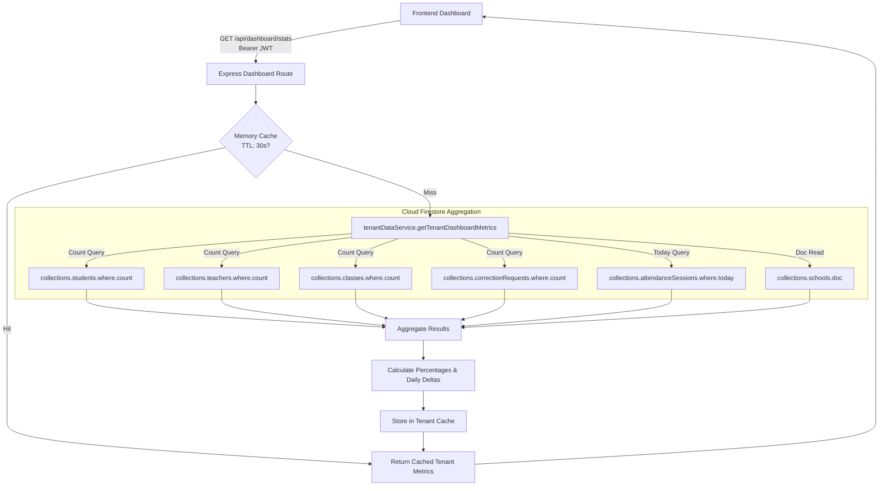

# Dashboard Data Mapping Specification

## 1. Overview

This document specifies the exact mapping between the **AttendoSchool Administrative Dashboard** visual user interface and the underlying **Firebase Cloud Firestore** schema, backend aggregation services (`tenantDataService.ts`), and API response contracts.

Every single figure, percentage, metric card, hero banner badge, and trend point rendered on the dashboard is traced directly to its authoritative Firestore source. 

> **Zero-Demo Rule**: In production mode, if a school is freshly initialized with zero records, the dashboard reflects pure zero/empty states (e.g. `0 Students`, `0 Teachers`, `0% Attendance`, `No attendance records for today`). Synthetic fallback numbers (such as `18 Students`, `8 Teachers`, `66.7% Attendance`) are completely forbidden.

---

## 2. Visual Dashboard KPI Mapping Matrix

| UI Component | Display Label | Firestore Collection | Aggregation Query / Expression | API Field in `/api/dashboard/stats` |
| :--- | :--- | :--- | :--- | :--- |
| **Hero Banner** | School Name | `schools/{schoolId}` | `doc.data().name` | `school.name` |
| **Hero Banner** | School Code | `schools/{schoolId}` | `doc.data().code` | `school.code` |
| **Hero Banner** | Affiliation / Board | `schools/{schoolId}` | `doc.data().affiliation` (e.g. `CBSE`) | `school.affiliation` |
| **Hero Banner** | Academic Session | `academic_years` | `.where('school_id', '==', sid).where('is_active', '==', true)` | `school.academicSession` |
| **Hero Banner** | Contact Enquiry | `schools/{schoolId}` | `doc.data().enquiry_phone` \|\| `doc.data().phone` | `school.enquiryPhone` |
| **Metric Card 1** | Total Students | `students` | `.where('school_id', '==', sid).where('is_active', '==', true).count()` | `summary.totalStudents` |
| **Metric Card 2** | Total Faculty / Staff | `teachers` | `.where('school_id', '==', sid).where('is_active', '==', true).count()` | `summary.totalTeachers` |
| **Metric Card 3** | Today's Attendance Rate | `attendance_sessions` + `attendance_records` | Aggregated present student count / total active student count | `summary.attendanceRate` |
| **Metric Card 4** | Active Classes | `classes` | `.where('school_id', '==', sid).count()` | `summary.totalClasses` |
| **Alert Badge** | Pending Corrections | `attendance_correction_requests` | `.where('school_id', '==', sid).where('status', '==', 'PENDING').count()` | `summary.pendingCorrections` |
| **Trend Chart** | 7-Day Attendance Trend | `attendance_sessions` + `attendance_records` | Grouped daily presence aggregated across 7 calendar days | `weeklyTrend` |
| **Breakdown Table**| Class-Wise Breakdown | `classes` + `attendance_records` | Section/Class grouped presence rate for current day | `classWiseAttendance` |

---

## 3. Detailed Aggregation & Pipeline Architecture



---

## 4. Query Definitions in `tenantDataService.ts`

### 4.1 Total Active Students
```typescript
const studentCountSnap = await collections.students()
  .where('school_id', '==', schoolId)
  .where('is_active', '==', true)
  .count()
  .get();

const totalStudents = studentCountSnap.data().count;
```

### 4.2 Total Active Faculty
```typescript
const teacherCountSnap = await collections.teachers()
  .where('school_id', '==', schoolId)
  .where('is_active', '==', true)
  .count()
  .get();

const totalTeachers = teacherCountSnap.data().count;
```

### 4.3 Total Academic Classes
```typescript
const classCountSnap = await collections.classes()
  .where('school_id', '==', schoolId)
  .count()
  .get();

const totalClasses = classCountSnap.data().count;
```

### 4.4 Pending Correction Requests
```typescript
const pendingCorrectionsSnap = await collections.attendanceCorrectionRequests()
  .where('school_id', '==', schoolId)
  .where('status', '==', 'PENDING')
  .count()
  .get();

const pendingCorrections = pendingCorrectionsSnap.data().count;
```

### 4.5 Today's Real-Time Attendance Rate
```typescript
const todayStr = new Date().toISOString().split('T')[0];

const todaySessionsSnap = await collections.attendanceSessions()
  .where('school_id', '==', schoolId)
  .where('attendance_date', '==', todayStr)
  .get();

let presentToday = 0;
let absentToday = 0;
let lateToday = 0;

for (const sessionDoc of todaySessionsSnap.docs) {
  const recordsSnap = await collections.attendanceRecords()
    .where('session_id', '==', sessionDoc.id)
    .where('school_id', '==', schoolId)
    .get();

  recordsSnap.forEach(r => {
    const status = r.data().status;
    if (status === 'PRESENT') presentToday++;
    else if (status === 'ABSENT') absentToday++;
    else if (status === 'LATE') lateToday++;
  });
}

const totalMarked = presentToday + absentToday + lateToday;
const attendanceRate = totalMarked > 0 
  ? Number(((presentToday / totalMarked) * 100).toFixed(1)) 
  : 0;
```

---

## 5. API Response Schema Contract

```json
{
  "summary": {
    "totalStudents": 0,
    "presentToday": 0,
    "absentToday": 0,
    "lateToday": 0,
    "attendanceRate": 0.0,
    "totalTeachers": 0,
    "totalClasses": 0,
    "pendingCorrections": 0
  },
  "school": {
    "name": "Greenwood International School",
    "code": "GW-2026",
    "affiliation": "CBSE Affiliated (No. 1930482)",
    "enquiryPhone": "+91 98765 43210",
    "academicSession": "2026–27",
    "subscriptionTier": "GROWTH"
  },
  "weeklyTrend": [
    { "date": "2026-09-23", "day": "Wed", "attendanceRate": 0.0, "present": 0, "absent": 0, "total": 0 },
    { "date": "2026-09-24", "day": "Thu", "attendanceRate": 0.0, "present": 0, "absent": 0, "total": 0 },
    { "date": "2026-09-25", "day": "Fri", "attendanceRate": 0.0, "present": 0, "absent": 0, "total": 0 },
    { "date": "2026-09-26", "day": "Sat", "attendanceRate": 0.0, "present": 0, "absent": 0, "total": 0 },
    { "date": "2026-09-27", "day": "Sun", "attendanceRate": 0.0, "present": 0, "absent": 0, "total": 0 },
    { "date": "2026-09-28", "day": "Mon", "attendanceRate": 0.0, "present": 0, "absent": 0, "total": 0 },
    { "date": "2026-09-29", "day": "Tue", "attendanceRate": 0.0, "present": 0, "absent": 0, "total": 0 }
  ],
  "classWiseAttendance": []
}
```

---

## 6. Frontend Handling of Empty vs Populated States

| Metric | Condition | Visual Representation |
| :--- | :--- | :--- |
| **Total Students** | `totalStudents === 0` | Display `"0"`, subtitle `"No students enrolled"` |
| **Total Students** | `totalStudents > 0` | Display formatted count (e.g., `"1,248"`), subtitle `"Active enrolled"` |
| **Attendance %** | `totalMarked === 0` | Display `"—"` or `"0.0%"`, subtitle `"Awaiting morning roll-call"` |
| **Attendance %** | `totalMarked > 0` | Display percentage badge (e.g., `"94.8%"`), color-coded green |
| **Weekly Trend** | All entries `0` | Displays flat baseline with tooltip `"No historical logs recorded"` |
| **Weekly Trend** | Values > 0 | Renders dynamic SVG sparkline/bar chart reflecting true historical percentages |
