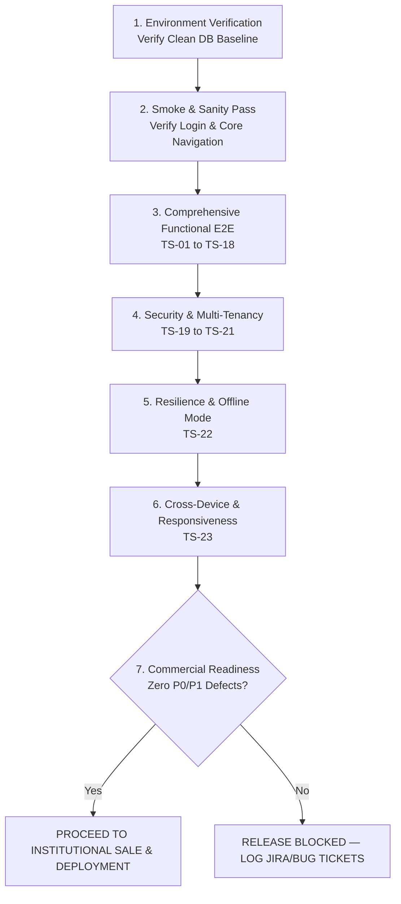

# AttendO School — End-to-End Enterprise Manual QA Testing Master Suite
## Comprehensive QA Manual Testing Handbook, Test Scenarios, Test Cases & Commercial Sale-Readiness Sign-Off
### Document ID: `QA-E2E-MANUAL-v2.5` | Target: Full Commercial Release (`school-attendance-saas`)

---

## 1. Document Control & Executive QA Overview

### 1.1 Document Information
- **Product Name**: AttendO School (`school-attendance-saas`)
- **System Version**: `v0.11.0` (Production SaaS Edition)
- **Primary Database Engine**: Supabase PostgreSQL 16 (Relational ACID Multi-Tenant)
- **Secondary / Backup Engine**: Firebase Cloud Firestore (Optional Sync Mirror)
- **Document Title**: Master End-to-End Manual Testing Guide & Test Case Specification
- **Target Audience**: Quality Assurance (QA) Engineers, Manual Testers, Product Managers, Implementation Specialists, Institutional Sales Engineers
- **Release Objective**: 100% Commercial Sale-Readiness Verification for K-12 Schools, Colleges, and Multi-Branch Educational Institutions.

---

### 1.2 Test Environment & Baseline Credentials

Before commencing manual test execution, ensure the testing environment is active (Local Dev Server `http://localhost:5173` or Staging Cloud `https://attendoschool.optinetinnovations.in`).

| Role | Email / Username | Password | School Code / Tenant Scope | Purpose / Capabilities |
| :--- | :--- | :--- | :--- | :--- |
| **Super Admin** | `superadmin@attendance.local` | `ChangeMe123!` | System-wide (All Schools) | Platform governance, school onboarding, subscriptions, billing, health. |
| **School Admin** | `admin@demo-school.local` | `ChangeMe123!` | `GIS001` (Greenwood International) | Complete institutional administration, sessions, teachers, students, reports. |
| **Teacher 1** | `rahul@demo-school.local` | `ChangeMe123!` | `GIS001` (Greenwood International) | Daily attendance marking, assigned classes, routine view. |
| **Teacher 2** | `priya@demo-school.local` | `ChangeMe123!` | `GIS001` (Greenwood International) | Secondary subject teacher, routine view, attendance. |
| **Student / Parent** | `student@greenwood.local` | `ChangeMe123!` | `GIS001` (Greenwood International) | Personal attendance calendar, percentage, timetable, notices. |

> **IMPORTANT**: The operational baseline of Greenwood International School (`GIS001`, `00000000-0000-0000-0000-000000000001`) has been cleansed of all mock records. Test cases that require students, classes, or attendance must test creation and lifecycle from the initial 0-count baseline.

---

### 1.3 Defect Severity & Priority Classification

Every defect discovered during manual execution must be logged with the following taxonomy:

| Severity | Definition | Commercial Release Impact |
| :--- | :--- | :--- |
| **P0 — Blocker** | System crash, data loss, cross-tenant security breach, login failure, or critical workflow completely halted. | **Immediate Release Halt**. Cannot sell or deploy to any customer. |
| **P1 — Critical** | Major business feature non-functional (e.g. attendance submit fails, Excel upload broken, reports empty). No viable workaround. | Must be fixed and verified before commercial contract signing. |
| **P2 — Major** | Feature works but with significant friction, inaccurate secondary calculation, or unexpected UI glitch. Workaround exists. | High priority hotfix. Must be cleared before institutional deployment. |
| **P3 — Minor** | Minor cosmetic defect, alignment issue, spelling typo, or non-blocking polish item. | Scheduled for standard maintenance sprint. |

---

## 2. Test Execution Workflow & Pass/Fail Criteria



### Pass Criteria:
- **Zero (0) P0 Blocker Defects**.
- **Zero (0) P1 Critical Defects**.
- **95%+ Passing Rate on P2 Major Cases**.
- **All Cross-Tenant Data Isolation and Security Checks 100% Passed**.

---

## 3. Functional Test Suites (Step-by-Step Test Cases)

---

### Test Suite 01: Authentication, Tenant Resolution & Session Management
- **Module**: `Authentication & Access Control`
- **Objective**: Verify secure authentication, role segregation, school code validation, and session persistence.

| Test Case ID | Priority | Test Scenario | Preconditions | Step-by-Step Execution | Expected Result | Pass / Fail |
| :--- | :---: | :--- | :--- | :--- | :--- | :---: |
| **TC-AUTH-001** | `P0` | School Admin login with valid credentials | App loaded at `/#/login` | 1. Enter School Code: `GIS001`<br/>2. Enter Email: `admin@demo-school.local`<br/>3. Enter Password: `ChangeMe123!`<br/>4. Click "Sign In" | Successfully authenticated; redirected to `/#/` (Admin Dashboard). JWT token stored; user info shows "Greenwood International" and Admin badge. | `[ ]` |
| **TC-AUTH-002** | `P0` | Super Admin platform login | App loaded at `/#/login` | 1. Leave School Code blank (or toggle Super Admin mode)<br/>2. Enter Email: `superadmin@attendance.local`<br/>3. Enter Password: `ChangeMe123!`<br/>4. Click "Sign In" | Redirected to Super Admin Overview (`/#/super-admin`). Platform controls and schools list visible. | `[ ]` |
| **TC-AUTH-003** | `P0` | Teacher login with valid credentials | App loaded at `/#/login` | 1. Enter School Code: `GIS001`<br/>2. Enter Email: `rahul@demo-school.local`<br/>3. Enter Password: `ChangeMe123!`<br/>4. Click "Sign In" | Redirected to Teacher Portal. Restricted sidebar (Attendance, Timetable, Profile only; no Admin settings visible). | `[ ]` |
| **TC-AUTH-004** | `P0` | Student / Parent portal login | App loaded at `/#/login` | 1. Enter School Code: `GIS001`<br/>2. Enter Email: `student@greenwood.local`<br/>3. Enter Password: `ChangeMe123!`<br/>4. Click "Sign In" | Redirected to Student/Parent Portal. Read-only attendance calendar, attendance %, and timetable visible. | `[ ]` |
| **TC-AUTH-005** | `P1` | Invalid password rejection | User on login screen | 1. Enter valid email: `admin@demo-school.local`<br/>2. Enter wrong password: `WrongPassword999`<br/>3. Click "Sign In" | Authentication rejected with clear error: "Invalid credentials or unauthorized school access". User remains on login screen. | `[ ]` |
| **TC-AUTH-006** | `P1` | Non-existent school code rejection | User on login screen | 1. Enter School Code: `INVALID999`<br/>2. Enter Email: `admin@demo-school.local`<br/>3. Click "Sign In" | Error message indicating school code not found. Form does not submit to backend credentials endpoint. | `[ ]` |
| **TC-AUTH-007** | `P2` | Password visibility toggle (Show/Hide) | User on login screen with password entered | 1. Enter text in password input<br/>2. Click eye icon in input field | Password characters toggle between masked (`••••••••`) and plaintext. Icon switches state. | `[ ]` |
| **TC-AUTH-008** | `P1` | Logout and token invalidation | User logged in as Admin | 1. Click user avatar/logout button in top-right header<br/>2. Confirm logout in prompt | User logged out immediately; redirected to `/#/login`. Browser storage cleared. Back button does not reveal authenticated pages. | `[ ]` |
| **TC-AUTH-009** | `P1` | Protected route redirect when unauthenticated | Browser in incognito window | 1. Directly paste URL `http://localhost:5173/#/academic-years`<br/>2. Press Enter | User intercepted immediately; redirected to `/#/login`. No flash of sensitive data. | `[ ]` |
| **TC-AUTH-010** | `P2` | Session persistence across browser refresh | Logged in as School Admin | 1. Navigate to `/#/classes`<br/>2. Press Ctrl+F5 (Hard Refresh) | Page reloads without logging user out. Active session, user profile, and active school context remain intact. | `[ ]` |

---

### Test Suite 02: Super Admin Platform Governance & Multi-School Management
- **Module**: `Super Admin Module` (`/#/super-admin/*`)
- **Objective**: Verify SaaS multi-tenant school onboarding, plan provisioning, GST tax invoicing, and platform health telemetry.

| Test Case ID | Priority | Test Scenario | Preconditions | Step-by-Step Execution | Expected Result | Pass / Fail |
| :--- | :---: | :--- | :--- | :--- | :--- | :---: |
| **TC-SUP-001** | `P0` | Super Admin Platform Overview Metrics | Logged in as Super Admin | 1. Navigate to `/#/super-admin`<br/>2. Inspect summary cards (Total Schools, Total Students, Active Subscriptions, Monthly Revenue) | Cards display real aggregate numbers from Supabase PostgreSQL without NaN or undefined errors. | `[ ]` |
| **TC-SUP-002** | `P0` | Onboard a new school entity | On `/#/super-admin/schools` | 1. Click "Add School"<br/>2. Enter Name: `St. Xavier Academy`<br/>3. School Code: `SXA001`<br/>4. Admin Email: `admin@stxavier.test`<br/>5. Select Plan: `Standard (Annual)`<br/>6. Click "Create School" | School created in database; appears in active schools directory with status `ACTIVE`. Initial Admin credentials generated. | `[ ]` |
| **TC-SUP-003** | `P1` | Prevent duplicate school code registration | On `/#/super-admin/schools` | 1. Click "Add School"<br/>2. Enter School Code: `GIS001` (existing)<br/>3. Submit form | System blocks creation with validation alert: "School code 'GIS001' is already in use". Database integrity preserved. | `[ ]` |
| **TC-SUP-004** | `P1` | Suspend and reactivate a school tenant | On `/#/super-admin/schools` | 1. Find school in list<br/>2. Click "Suspend School"<br/>3. Confirm in modal<br/>4. Attempt to log in with that school's credentials<br/>5. Back in Super Admin, click "Reactivate" | School status changes to `SUSPENDED`. School users receive "Institution access suspended" error on login. After reactivation, login works again. | `[ ]` |
| **TC-SUP-005** | `P1` | Invoices & Indian GST Ledger verification | On `/#/super-admin/invoices` | 1. Inspect recent invoices table<br/>2. Click "View Invoice" on an invoice<br/>3. Verify GST breakdown | Displays SAC Code 998313, 18% GST (9% CGST + 9% SGST for intra-state or 18% IGST for inter-state), B2B/B2C invoice format. | `[ ]` |
| **TC-SUP-006** | `P2` | Platform Health & Database Latency Monitor | On `/#/super-admin/monitoring` | 1. Open Monitoring & Health tab<br/>2. Inspect PostgreSQL connection status, response latency, and memory | Database connection displays `HEALTHY (SSL)`. Latency measured in ms (<200ms target). | `[ ]` |
| **TC-SUP-007** | `P1` | Security Center & Audit Log Inspection | On `/#/super-admin/security` | 1. Inspect recent authentication logs<br/>2. Filter by failed logins and IP address | Log reflects recent login attempts, user IDs, timestamp, and action types. | `[ ]` |

---

### Test Suite 03: School Admin Dashboard & Baseline Integrity
- **Module**: `Admin Dashboard` (`/#/`)
- **Objective**: Verify live dynamic metrics, clean baseline (no synthetic ghost counts), and quick action responsiveness.

| Test Case ID | Priority | Test Scenario | Preconditions | Step-by-Step Execution | Expected Result | Pass / Fail |
| :--- | :---: | :--- | :--- | :--- | :--- | :---: |
| **TC-ADM-001** | `P0` | Verify clean baseline metrics (No fake data) | Greenwood Admin logged in; zero students created | 1. Navigate to Dashboard (`/#/`)<br/>2. Inspect KPI metric cards (Total Students, Total Classes, Today's Attendance) | Metric cards reflect exact database state (`0 Students`, `0 Classes` or current real count). Absolutely no mock numbers (e.g. 140, 185, 42). | `[ ]` |
| **TC-ADM-002** | `P1` | Active Academic Session banner | Active session configured | 1. Observe top header and dashboard banner | Displays currently active session (e.g., `2025–26 Academic Session`). Banner reflects status `ACTIVE`. | `[ ]` |
| **TC-ADM-003** | `P1` | Quick Actions navigation links | On Dashboard | 1. Click "Take Attendance"<br/>2. Click "Add Student"<br/>3. Click "Manage Routine" | Each button navigates directly to the designated module without 404 or route error. | `[ ]` |
| **TC-ADM-004** | `P2` | Real-time Attendance Gauge Chart | Students enrolled and attendance marked | 1. View Attendance Overview doughnut/bar chart | Displays calculated percentage of Present vs Absent vs Late for today. Tooltip shows exact headcount. | `[ ]` |

---

### Test Suite 04: Academic Year & Session Lifecycle (Database-Backed)
- **Module**: `Academic Years` (`/#/academic-years`)
- **Objective**: Verify end-to-end CRUD, single-active session constraint, archive/unarchive, activate/deactivate, and real dynamic student/class counts.

| Test Case ID | Priority | Test Scenario | Preconditions | Step-by-Step Execution | Expected Result | Pass / Fail |
| :--- | :---: | :--- | :--- | :--- | :--- | :---: |
| **TC-AY-001** | `P0` | Create a new Academic Year | School Admin on `/#/academic-years` | 1. In "Create Academic Year", enter Name: `2027–28 Academic Session`<br/>2. Select Start Date: `2027-04-01`<br/>3. Select End Date: `2028-03-31`<br/>4. Click "Create" | Session saved to PostgreSQL. Table immediately adds row with Status `INACTIVE`, Student Count `0`, Class Count `0`. Toast notification: "Academic year created successfully". | `[ ]` |
| **TC-AY-002** | `P1` | Date validation on Academic Year creation | On `/#/academic-years` | 1. Enter Start Date: `2027-04-01`<br/>2. Enter End Date: `2026-03-31` (End date before start date)<br/>3. Click "Create" | Form blocked with error: "End date must be greater than start date". Backend check constraint `academic_years_check` protected. | `[ ]` |
| **TC-AY-003** | `P0` | Activate an Inactive Academic Year | Row with status `INACTIVE` exists | 1. Locate inactive session (e.g. `2026–27`)<br/>2. Click blue **Activate** button<br/>3. Safety confirmation modal appears<br/>4. Click "Confirm Activation" | Target session becomes `ACTIVE` (green badge). Any previously active session automatically switches to `INACTIVE`. Single-active constraint strictly maintained in DB. | `[ ]` |
| **TC-AY-004** | `P0` | Deactivate an Active Academic Year | Row with status `ACTIVE` exists | 1. Locate active session<br/>2. Click amber **Deactivate** button<br/>3. Confirm in modal | Session status transitions to `INACTIVE` (gray badge). Database `is_active` set to `FALSE`. UI action buttons update to show "Activate" and "Archive". | `[ ]` |
| **TC-AY-005** | `P0` | Archive an Academic Year | Row with status `INACTIVE` exists | 1. Locate session<br/>2. Click red **Archive** button<br/>3. Read warning: "Historical records will be preserved read-only"<br/>4. Confirm | Session status changes to `ARCHIVED` (red badge). Database `is_archived` set to `TRUE`, `is_active` set to `FALSE`. | `[ ]` |
| **TC-AY-006** | `P0` | Unarchive an Archived Academic Year | Row with status `ARCHIVED` exists | 1. Locate archived session<br/>2. Click emerald **Unarchive** button<br/>3. Confirm in modal | Session status changes back to `INACTIVE`. Database `is_archived` set to `FALSE`. Session is fully editable again. | `[ ]` |
| **TC-AY-007** | `P0` | Verify dynamic Student & Class counts | Students/Classes added to session | 1. Observe "STUDENTS" and "CLASSES" columns in the table | Displays exact count of students and classes linked to that specific `academic_year_id` in database. Zero synthetic numbers. | `[ ]` |
| **TC-AY-008** | `P1` | Prevent duplicate session name | Existing session `2025–26` | 1. Enter identical name `2025–26 Academic Session`<br/>2. Submit form | Rejected with error: "Academic session with this name already exists". Unique index `uq_academic_year_school_name` enforced. | `[ ]` |

---

### Test Suite 05: Class & Section Management
- **Module**: `Classes & Sections` (`/#/classes`)
- **Objective**: Verify creation of class hierarchies, section capacities, class teacher assignments, and cascade protection.

| Test Case ID | Priority | Test Scenario | Preconditions | Step-by-Step Execution | Expected Result | Pass / Fail |
| :--- | :---: | :--- | :--- | :--- | :--- | :---: |
| **TC-CLS-001** | `P0` | Add new Class with Section | School Admin on `/#/classes` | 1. Click "Add Class"<br/>2. Enter Class Number/Name: `Grade 10`<br/>3. Initial Section: `A`<br/>4. Room Number: `Room 101`<br/>5. Max Student Capacity: `40`<br/>6. Click "Save Class" | Class and section created in PostgreSQL. Rendered in classes list with section badge `A (Capacity: 40)`. | `[ ]` |
| **TC-CLS-002** | `P0` | Add additional Section to existing Class | Class `Grade 10` exists | 1. Click "Add Section" under `Grade 10`<br/>2. Section Name: `B`<br/>3. Capacity: `40`<br/>4. Click "Save" | Section `B` appended to `Grade 10`. Can now be selected in student registration and attendance. | `[ ]` |
| **TC-CLS-003** | `P1` | Assign Class Teacher to Section | Teachers exist in school directory | 1. Click edit icon on `Grade 10 - Section A`<br/>2. In "Class Teacher" dropdown, select `Rahul Sharma`<br/>3. Click "Update" | Teacher assigned. Teacher's portal now lists `Grade 10-A` as their assigned homeroom class. | `[ ]` |
| **TC-CLS-004** | `P1` | Prevent duplicate section name in same class | Class `Grade 10` has Section `A` | 1. Click "Add Section"<br/>2. Enter Section Name: `A`<br/>3. Click "Save" | Validation error: "Section 'A' already exists for this class". Form not submitted. | `[ ]` |
| **TC-CLS-005** | `P1` | Delete empty Section | Section has 0 enrolled students | 1. Click delete trash icon on empty section<br/>2. Confirm deletion | Section deleted from database and removed from UI. | `[ ]` |
| **TC-CLS-006** | `P0` | Prevent deletion of Section with enrolled students | Section has >= 1 enrolled student | 1. Attempt to delete section that has students enrolled | System prevents deletion with modal alert: "Cannot delete section with active enrolled students. Reassign students first." Foreign key protection intact. | `[ ]` |

---

### Test Suite 06: Subject Management
- **Module**: `Subjects` (`/#/subjects`)
- **Objective**: Verify subject catalog, theory/practical classification, and class-subject mapping.

| Test Case ID | Priority | Test Scenario | Preconditions | Step-by-Step Execution | Expected Result | Pass / Fail |
| :--- | :---: | :--- | :--- | :--- | :--- | :---: |
| **TC-SUB-001** | `P0` | Create new Subject | Admin on `/#/subjects` | 1. Click "Add Subject"<br/>2. Name: `Mathematics`<br/>3. Subject Code: `MATH101`<br/>4. Type: `Theory`<br/>5. Applicable Classes: Select `Grade 10`<br/>6. Click "Save" | Subject created in PostgreSQL. Listed in subject table with code `MATH101` and badge `Theory`. | `[ ]` |
| **TC-SUB-002** | `P1` | Create Practical / Lab Subject | Admin on `/#/subjects` | 1. Name: `Physics Practical`<br/>2. Code: `PHY-LAB`<br/>3. Type: `Practical`<br/>4. Save | Subject tagged as practical. Available for lab timetable period slots. | `[ ]` |
| **TC-SUB-003** | `P1` | Assign primary teacher to Subject | Teachers registered | 1. Edit `Mathematics`<br/>2. Assign `Rahul Sharma`<br/>3. Save | Subject linked to teacher in database. Teacher's timetable allows scheduling this subject. | `[ ]` |
| **TC-SUB-004** | `P1` | Prevent duplicate subject code | Subject `MATH101` exists | 1. Attempt to create another subject with Code `MATH101`<br/>2. Click Save | Blocked with error: "Subject code must be unique within the school". | `[ ]` |

---

### Test Suite 07: Teacher & Staff Management
- **Module**: `Teachers & Staff` (`/#/teachers` or `/#/people`)
- **Objective**: Verify teacher onboarding, subject/class allocation, credential auto-generation, and profile editing.

| Test Case ID | Priority | Test Scenario | Preconditions | Step-by-Step Execution | Expected Result | Pass / Fail |
| :--- | :---: | :--- | :--- | :--- | :--- | :---: |
| **TC-TCH-001** | `P0` | Onboard single Teacher with Login Credentials | Admin on `/#/teachers` | 1. Click "Add Teacher"<br/>2. Full Name: `Ananya Sen`<br/>3. Email: `ananya@demo-school.local`<br/>4. Phone: `9876543210`<br/>5. Employee ID: `EMP-015`<br/>6. Check "Generate Portal Login"<br/>7. Click "Save Teacher" | Teacher record created in `teachers` table. User created in `users` table with role `TEACHER`. Modal presents generated temporary credentials with 1-click copy button. | `[ ]` |
| **TC-TCH-002** | `P0` | Test generated Teacher login | Teacher credentials generated | 1. Open incognito window<br/>2. Login with `ananya@demo-school.local`<br/>3. Enter temporary password | Teacher logs in successfully. Directed to Teacher Portal. | `[ ]` |
| **TC-TCH-003** | `P1` | Deactivate Teacher | Active teacher exists | 1. In teacher directory, click status toggle to "Inactive"<br/>2. Confirm in modal | Teacher status set to `INACTIVE`. Login revoked immediately; existing active tokens rejected on subsequent API calls. | `[ ]` |
| **TC-TCH-004** | `P1` | Edit Teacher Profile & Qualifications | Teacher exists | 1. Click "Edit Profile"<br/>2. Update Qualification: `M.Sc. Mathematics, B.Ed.`<br/>3. Update Phone<br/>4. Save | Updates persisted in PostgreSQL. Reflected in teacher details card. | `[ ]` |
| **TC-TCH-005** | `P2` | Search & Filter Teacher Directory | Multiple teachers in list | 1. Enter "Rahul" in search box<br/>2. Filter by Department "Science" | Table filters instantly in real-time matching query. Clear button resets filter. | `[ ]` |

---

### Test Suite 08: Student Enrollment, Profile & Universal Preview/Edit
- **Module**: `Students Management` (`/#/students`)
- **Objective**: Verify manual student addition, Excel template download, bulk Excel upload, preview-and-edit confirmation modal, roll uniqueness, and student profile.

| Test Case ID | Priority | Test Scenario | Preconditions | Step-by-Step Execution | Expected Result | Pass / Fail |
| :--- | :---: | :--- | :--- | :--- | :--- | :---: |
| **TC-STU-001** | `P0` | Download Standard Blank Excel Template | Admin on `/#/students` | 1. Click "Bulk Upload"<br/>2. Click "Download Excel Template" (`/api/students/template`) | Downloads `.xlsx` file. File opens cleanly in Microsoft Excel / Google Sheets with standard columns: `First Name*`, `Last Name`, `Admission Number*`, `Roll Number*`, `Class Number*`, `Section Name*`, `Parent Name*`, `Parent Phone*`, `Parent Email`. | `[ ]` |
| **TC-STU-002** | `P0` | Register Single Student manually | Class and Section exist | 1. Click "Add Student"<br/>2. First Name: `Aarav`, Last Name: `Patel`<br/>3. Admission No: `ADM-2026-001`<br/>4. Roll No: `01`<br/>5. Class: `Grade 10`, Section: `A`<br/>6. Parent Name: `Vikram Patel`, Phone: `9876500001`<br/>7. Click "Save Student" | Student record saved to PostgreSQL `students` table. Linked to current active `academic_year_id`. Student appears in student list with Roll `01`. | `[ ]` |
| **TC-STU-003** | `P1` | Prevent duplicate Roll Number in same section | Student with Roll `01` in Grade 10-A | 1. Click "Add Student"<br/>2. Enter Roll No: `01`, Class: `Grade 10`, Section: `A`<br/>3. Fill other fields<br/>4. Click Save | Blocked with error: "Roll number 01 is already assigned in Grade 10 Section A". Unique section-roll constraint protected. | `[ ]` |
| **TC-STU-004** | `P1` | Prevent duplicate Admission Number across school | Student with Admission `ADM-2026-001` exists | 1. Click "Add Student"<br/>2. Enter Admission No: `ADM-2026-001`<br/>3. Select different section<br/>4. Save | Blocked with error: "Admission number must be unique across the institution". Global uniqueness preserved. | `[ ]` |
| **TC-STU-005** | `P0` | Bulk Upload via Excel with Universal Preview Grid | Filled template with 10 students | 1. Click "Bulk Upload Students"<br/>2. Select prepared `.xlsx` file<br/>3. Inspect Universal Preview & Edit Modal | Modal opens before database insertion. Shows 10 rows with editable cells, green checkmarks on valid rows, and no blocking errors. | `[ ]` |
| **TC-STU-006** | `P0` | Edit values inside Universal Preview Grid before commit | In Preview Grid modal | 1. Click cell "Parent Phone" on row 2<br/>2. Modify value<br/>3. Click "Confirm & Import 10 Students" | Edited data sent to backend; all 10 students inserted in database. Student directory updates with 10 new records. | `[ ]` |
| **TC-STU-007** | `P1` | Bulk Upload validation error highlighting | Excel has missing required parent phone | 1. Upload sheet with empty phone on row 3<br/>2. Inspect Preview Modal | Row 3 highlighted in red with badge "Missing Parent Phone". Import button disabled until row is corrected or omitted. | `[ ]` |
| **TC-STU-008** | `P1` | Student Profile Modal & Photo Upload | Student in directory | 1. Click student name or view action<br/>2. Open profile modal<br/>3. Upload student photo (`.jpg`/`.png`)<br/>4. Save | Photo uploaded and rendered in student card and attendance avatar list. | `[ ]` |
| **TC-STU-009** | `P1` | Soft-delete / Archive Student | Student in directory | 1. Click delete icon on student<br/>2. Confirmation modal asks for reason<br/>3. Confirm deletion | Student marked `is_active = FALSE`. Historical attendance records retained for auditing; student removed from active roster. | `[ ]` |

---

### Test Suite 09: Daily Classroom Attendance Lifecycle
- **Module**: `Daily Attendance` (`/#/attendance`)
- **Objective**: Verify class roster rendering, attendance marking (Present/Absent/Late/Half-day/Excused), bulk 1-click toggle, submission confirmation, past-date corrections, and double-submit prevention.

| Test Case ID | Priority | Test Scenario | Preconditions | Step-by-Step Execution | Expected Result | Pass / Fail |
| :--- | :---: | :--- | :--- | :--- | :--- | :---: |
| **TC-ATT-001** | `P0` | Load Classroom Roster for Today | Students enrolled in Grade 10-A | 1. Navigate to `/#/attendance`<br/>2. Select Date: Today<br/>3. Select Class: `Grade 10`, Section: `A`<br/>4. Click "Load Roster" | Roster loads all active students with Roll number, Name, Photo, and 5 status pills: `[P] [A] [L] [HD] [EX]`. | `[ ]` |
| **TC-ATT-002** | `P0` | 1-Click "Mark All Present" Bulk Action | Roster loaded with default state | 1. Click "Mark All Present" button at top of roster | All student pills switch to `PRESENT` (Green). Attendance counter updates: e.g. "10 Present, 0 Absent (100%)". | `[ ]` |
| **TC-ATT-003** | `P0` | Mark Individual Absent with Reason / Remark | Roster marked present | 1. Click `[A]` (Absent) pill on Student Roll 03<br/>2. Input text in remark box: "Fever reported by parent" | Student pill turns Red `ABSENT`. Remark badge appears. Counter updates: "9 Present, 1 Absent (90%)". | `[ ]` |
| **TC-ATT-004** | `P1` | Mark Statuses: Late, Half-Day, Excused | Roster loaded | 1. Set Student 04 to `[L]` (Late, Amber)<br/>2. Set Student 05 to `[HD]` (Half-Day, Purple)<br/>3. Set Student 06 to `[EX]` (Excused, Blue) | Each status color-codes correctly. Metric breakdown shows counts for all 5 distinct statuses. | `[ ]` |
| **TC-ATT-005** | `P0` | Submit Attendance with Universal Confirmation Modal | Roster fully marked | 1. Click "Submit Attendance"<br/>2. Inspect Universal Confirmation Modal | Modal displays summary breakdown: "Total: 10 | Present: 7 | Absent: 1 | Late: 1 | Half-Day: 1". Asks for confirmation. | `[ ]` |
| **TC-ATT-006** | `P0` | Finalize Attendance Submission & Database Write | In Confirmation Modal | 1. Click "Confirm & Save Attendance" | Submits to `POST /api/attendance`. Records written to Supabase PostgreSQL `attendance` table. Banner changes to "Attendance Saved for Today". | `[ ]` |
| **TC-ATT-007** | `P1` | Double-Submission Protection | Attendance already submitted | 1. Attempt to click Submit again or rapidly double-click | Submit button disabled and shows "Saved". Backend idempotency key prevents duplicate row creation. | `[ ]` |
| **TC-ATT-008** | `P1` | Edit Same-Day Attendance | Same-day attendance saved | 1. Click "Edit Attendance"<br/>2. Change Student 03 from Absent to Present<br/>3. Click "Update Attendance" | Records updated in database. Audit record captures who modified attendance and timestamp. | `[ ]` |
| **TC-ATT-009** | `P0` | Historical Past Attendance Correction Workflow | Attendance marked 5 days ago | 1. Select date 5 days prior<br/>2. Click "Request Correction"<br/>3. Reason required: "Parent medical certificate submitted"<br/>4. Admin approves change | Past date cannot be casually modified without administrative audit reason. Audit trail recorded in `attendance_corrections`. | `[ ]` |
| **TC-ATT-010** | `P1` | Sunday / Gazetted Holiday Attendance Guard | Selected date is Sunday / Holiday | 1. Select upcoming Sunday on datepicker | Warning banner: "Selected date is a declared non-instructional day (Holiday/Sunday)". Attendance marking controls disabled by default. | `[ ]` |

---

### Test Suite 10: Subject-Wise / Period-Wise Attendance
- **Module**: `Period Attendance` (`/#/attendance/subject-wise`)
- **Objective**: Verify subject-specific attendance tracking for high schools and colleges.

| Test Case ID | Priority | Test Scenario | Preconditions | Step-by-Step Execution | Expected Result | Pass / Fail |
| :--- | :---: | :--- | :--- | :--- | :--- | :---: |
| **TC-SWATT-001** | `P1` | Load Period Roster by Subject | Timetable configured | 1. Select Class `Grade 10-A`<br/>2. Select Subject: `Mathematics`<br/>3. Select Period: `Period 2 (10:00 - 10:45 AM)`<br/>4. Load Roster | Shows class roster for that specific lecture. Pre-populates daily homeroom attendance status as advisory hint. | `[ ]` |
| **TC-SWATT-002** | `P1` | Submit Subject Attendance | Roster marked | 1. Mark 1 student absent for Period 2<br/>2. Submit subject attendance | Saved to database linked to `subject_id` and `timetable_slot_id`. Subject attendance report reflects period absence. | `[ ]` |

---

### Test Suite 11: Teacher Attendance & Biometric / RFID Log
- **Module**: `Staff Attendance` (`/#/staff-attendance`)
- **Objective**: Verify teacher check-in/out, biometric log simulation, and monthly teacher registers.

| Test Case ID | Priority | Test Scenario | Preconditions | Step-by-Step Execution | Expected Result | Pass / Fail |
| :--- | :---: | :--- | :--- | :--- | :--- | :---: |
| **TC-TATT-001** | `P1` | Teacher Daily Manual Check-In | Admin on Staff Attendance | 1. Locate `Rahul Sharma`<br/>2. Click "Check-In" at `08:02 AM`<br/>3. Select Status `PRESENT` | Check-in timestamp saved. Tagged as "On Time" (before grace period cutoff 08:15 AM). | `[ ]` |
| **TC-TATT-002** | `P1` | Late Arrival calculation | Shift starts 08:00 AM, grace 15 min | 1. Check-in teacher at `08:35 AM` | System automatically tags status as `LATE` (Delay: 35 minutes). | `[ ]` |
| **TC-TATT-003** | `P2` | Teacher Check-Out & Working Hours calculation | Teacher checked in at 08:00 AM | 1. Click "Check-Out" at `03:30 PM` | Total working hours calculated automatically (7 hrs 30 mins). Log saved in staff attendance ledger. | `[ ]` |

---

### Test Suite 12: Timetable & Routine Management
- **Module**: `Timetable Management` (`/#/timetable`)
- **Objective**: Verify period configuration, drag-and-drop schedule building, teacher clash detection, and PDF routine export.

| Test Case ID | Priority | Test Scenario | Preconditions | Step-by-Step Execution | Expected Result | Pass / Fail |
| :--- | :---: | :--- | :--- | :--- | :--- | :---: |
| **TC-TT-001** | `P0` | Configure School Bell Timings & Period Slots | Admin on `/#/timetable` | 1. Open "Period Settings"<br/>2. Add Period 1: `08:30 - 09:15 AM`<br/>3. Add Period 2: `09:15 - 10:00 AM`<br/>4. Add Break: `10:00 - 10:30 AM`<br/>5. Click Save | Period slots configured. Grid updates with Monday-Saturday timeline. | `[ ]` |
| **TC-TT-002** | `P0` | Assign Subject & Teacher to Class Slot | Slots created | 1. Select `Grade 10-A`<br/>2. In Monday Period 1 slot, select Subject `Mathematics`<br/>3. Select Teacher `Rahul Sharma`<br/>4. Click "Assign" | Slot displays `Mathematics — Rahul Sharma`. Saved to PostgreSQL `timetable_slots`. | `[ ]` |
| **TC-TT-003** | `P0` | Teacher Clash Detection (Double Booking Alert) | Rahul assigned Monday Period 1 in 10-A | 1. Switch to `Grade 9-A`<br/>2. Try assigning `Rahul Sharma` to Monday Period 1 | System blocks assignment with alert: "Teacher Clash Detected! Rahul Sharma is already assigned to Grade 10-A on Monday Period 1". Conflict prevention 100% verified. | `[ ]` |
| **TC-TT-004** | `P1` | View Teacher-Wise Weekly Routine | Timetable slots populated | 1. Toggle view to "Teacher Routine"<br/>2. Select `Rahul Sharma` | Displays consolidated weekly schedule for Rahul Sharma across all assigned classes. | `[ ]` |
| **TC-TT-005** | `P2` | Export Timetable to PDF | Routine configured | 1. Click "Export PDF Routine" | Generates clean, branded printable PDF timetable with school header and period grid. | `[ ]` |

---

### Test Suite 13: Student Promotion & Academic Session Transition
- **Module**: `Student Promotions` (`/#/student-promotions`)
- **Objective**: Verify year-end student promotion across academic sessions, detentions, and graduation/alumni classification.

| Test Case ID | Priority | Test Scenario | Preconditions | Step-by-Step Execution | Expected Result | Pass / Fail |
| :--- | :---: | :--- | :--- | :--- | :--- | :---: |
| **TC-PROM-001** | `P0` | Setup Academic Session Transition | 2025–26 active; 2026–27 inactive/active | 1. Navigate to `/#/student-promotions`<br/>2. Select Source Session: `2025–26`<br/>3. Select Target Session: `2026–27`<br/>4. Select Source Class: `Grade 9-A`<br/>5. Select Target Class: `Grade 10-A` | Lists all students currently in Grade 9-A with current attendance % and academic status. | `[ ]` |
| **TC-PROM-002** | `P0` | Execute Bulk Promotion with Preview | 10 students in Grade 9-A | 1. Check "Select All"<br/>2. Set status to `PROMOTE`<br/>3. Click "Preview Promotions"<br/>4. Review confirmation dialog<br/>5. Click "Execute Promotions" | Database transaction moves 10 students into `2026–27` session under `Grade 10-A`. Source session records preserved as historical snapshot. | `[ ]` |
| **TC-PROM-003** | `P1` | Handle Detained / Repeat Students | Mixed promotion selection | 1. For Student Roll 08, toggle action to `DETAIN (Repeat Class)`<br/>2. Execute promotions | Student Roll 08 remains in `Grade 9-A` for session `2026–27`. Other students advance to `Grade 10-A`. | `[ ]` |
| **TC-PROM-004** | `P1` | Mark Final Year Students as Graduated / Alumni | Class is final grade (e.g. Grade 12) | 1. Select Source Class `Grade 12-A`<br/>2. Set Target Action to `GRADUATE / ALUMNI`<br/>3. Execute | Students status set to `ALUMNI`. Removed from active attendance rolls while academic records preserved. | `[ ]` |

---

### Test Suite 14: Notice Board, Announcements & Parent Notifications
- **Module**: `Announcements & Parent Communication` (`/#/announcements`, `/#/parent-communication`)
- **Objective**: Verify targeted broadcasts, absence alerts (WhatsApp / SMS simulation), and delivery logging.

| Test Case ID | Priority | Test Scenario | Preconditions | Step-by-Step Execution | Expected Result | Pass / Fail |
| :--- | :---: | :--- | :--- | :--- | :--- | :---: |
| **TC-COM-001** | `P0` | Broadcast School Announcement to All | Admin on `/#/announcements` | 1. Click "Create Announcement"<br/>2. Title: `Annual Sports Day 2026`<br/>3. Audience: `All (Teachers, Parents, Students)`<br/>4. Content: "Sports Day scheduled for Friday..."<br/>5. Click "Publish" | Announcement appears on dashboard noticeboard for all roles (Super Admin, Teacher, Student, Parent). | `[ ]` |
| **TC-COM-002** | `P1` | Targeted Announcement to Parents Only | Admin on `/#/announcements` | 1. Audience: Select `Parents Only`<br/>2. Title: `PTM Meeting Schedule`<br/>3. Publish<br/>4. Verify as Teacher and Student | Notice visible in Parent Portal; hidden from Teacher and Student dashboards. Audience filter verified. | `[ ]` |
| **TC-COM-003** | `P0` | Automated Absence Notification Trigger | Attendance marked with 2 absentees | 1. Complete attendance submission with absentees<br/>2. Check "Trigger Absence Alerts"<br/>3. Inspect Communication Logs (`/#/parent-communication`) | Absence notifications generated for parents of absent students. Content: "Dear Parent, Aarav Patel was marked Absent on [Date] at Greenwood International." Delivery status `SENT` or `SIMULATED_SUCCESS`. | `[ ]` |
| **TC-COM-004** | `P2` | Direct Message to Parent | Admin/Teacher on Parent Communication | 1. Select student `Aarav Patel`<br/>2. Type custom message: "Please bring doctor certificate"<br/>3. Click Send | Message logged in parent communication thread. Visible when parent logs in. | `[ ]` |

---

### Test Suite 15: Attendance Reports, Analytics & Exports
- **Module**: `Attendance Reports` (`/#/reports`)
- **Objective**: Verify daily, monthly, and class registers, <75% defaulter filters, student report cards, and Excel/PDF exports.

| Test Case ID | Priority | Test Scenario | Preconditions | Step-by-Step Execution | Expected Result | Pass / Fail |
| :--- | :---: | :--- | :--- | :--- | :--- | :---: |
| **TC-REP-001** | `P0` | Generate Monthly Attendance Register | 30 days of attendance marked | 1. Navigate to `/#/reports`<br/>2. Report Type: `Monthly Register`<br/>3. Select Class `Grade 10-A`<br/>4. Select Month: `September 2026`<br/>5. Click "Generate Report" | Renders full 31-day grid with rows as students, columns as dates (1–30), displaying `P`, `A`, `L`, `HD`, `H` symbols. Bottom row shows daily class presence %. | `[ ]` |
| **TC-REP-002** | `P0` | Low Attendance Defaulter Filter (<75% Threshold) | Students with varying attendance | 1. Select Report Type: `Defaulters / Low Attendance`<br/>2. Set Threshold: `< 75%`<br/>3. Click Filter | Table isolates only students whose cumulative attendance is under 75%. Displays Parent Phone and total missed days. | `[ ]` |
| **TC-REP-003** | `P0` | Export Attendance Report to Excel (`.xlsx`) | Report generated on screen | 1. Click "Export Excel" button | Downloads clean `.xlsx` spreadsheet with school header, date range, columns, and color-coded statuses. Opens in Excel without corruption. | `[ ]` |
| **TC-REP-004** | `P0` | Export Attendance Report to PDF | Report generated | 1. Click "Export PDF" button | Downloads formatted PDF with official school letterhead, Greenwood International logo, summary statistics table, and signature line for Principal. | `[ ]` |
| **TC-REP-005** | `P1` | Individual Student Attendance Report Card | Student selected | 1. Select Report Type: `Student Comprehensive`<br/>2. Select `Aarav Patel` | Displays monthly breakdown, total working days, days present, days absent, attendance %, and graphical circular progress meter. | `[ ]` |

---

### Test Suite 16: School Settings, Timings, Holidays & Subscription
- **Module**: `School Settings` (`/#/settings`)
- **Objective**: Verify school profile customization, working days, holiday manager, and subscription quota limits.

| Test Case ID | Priority | Test Scenario | Preconditions | Step-by-Step Execution | Expected Result | Pass / Fail |
| :--- | :---: | :--- | :--- | :--- | :--- | :---: |
| **TC-SET-001** | `P1` | Update School Profile & Contact Details | Admin on `/#/settings` | 1. Update School Address, Phone, Principal Name<br/>2. Click "Save Settings" | Settings saved to PostgreSQL `schools` table. Reflected in report headers and login card. | `[ ]` |
| **TC-SET-002** | `P1` | Configure Weekly Working Days & Weekend Rules | In Settings tab | 1. Toggle Saturday to `Half-Day` or `Off`<br/>2. Toggle Sunday to `Off`<br/>3. Save | Attendance calendar automatically disables roll-call marking for Sunday and marks Saturday accordingly. | `[ ]` |
| **TC-SET-003** | `P1` | Gazetted Holiday Manager | In Holidays tab | 1. Click "Add Holiday"<br/>2. Name: `Gandhi Jayanti`<br/>3. Date: `2026-10-02`<br/>4. Type: `National Holiday`<br/>5. Save | Date locked on all attendance registers with label "Gandhi Jayanti". | `[ ]` |
| **TC-SET-004** | `P0` | Subscription Student Quota Enforcement | Plan limit: 100 students | 1. School has 100 students<br/>2. Attempt to add 101st student | System intercepts creation with alert: "Student enrollment limit reached for your Standard Plan (100/100). Please upgrade plan in billing settings." Prevents unauthorized quota bypass. | `[ ]` |

---

### Test Suite 17: Dedicated Teacher Portal Flow
- **Module**: `Teacher Experience`
- **Objective**: Verify teacher views only assigned classes, takes daily attendance, and has zero access to administrative settings.

| Test Case ID | Priority | Test Scenario | Preconditions | Step-by-Step Execution | Expected Result | Pass / Fail |
| :--- | :---: | :--- | :--- | :--- | :--- | :---: |
| **TC-PORT-TCH-001** | `P0` | Teacher Portal Class Isolation | Logged in as `rahul@demo-school.local` | 1. Open Attendance module<br/>2. Inspect Class dropdown | Only classes where Rahul is assigned Class Teacher or Subject Teacher appear. Unassigned classes hidden from dropdown. | `[ ]` |
| **TC-PORT-TCH-002** | `P0` | Teacher Submits Daily Attendance | Assigned to Grade 10-A | 1. Mark attendance for Grade 10-A<br/>2. Submit and confirm | Attendance saved. Teacher's dashboard card updates to "Attendance Completed for Today". | `[ ]` |
| **TC-PORT-TCH-003** | `P1` | View Personal Routine & Classes | In Teacher Portal | 1. Click "My Timetable" | Displays weekly schedule of classes and periods assigned strictly to Rahul Sharma. | `[ ]` |

---

### Test Suite 18: Dedicated Student & Parent Portal Flow
- **Module**: `Student / Parent Experience`
- **Objective**: Verify transparent view of attendance percentage, daily status, absence remarks, and timetable.

| Test Case ID | Priority | Test Scenario | Preconditions | Step-by-Step Execution | Expected Result | Pass / Fail |
| :--- | :---: | :--- | :--- | :--- | :--- | :---: |
| **TC-PORT-PAR-001** | `P0` | Student / Parent Attendance Overview | Logged in as `student@greenwood.local` | 1. View Home Screen | Displays student name, roll number, class `Grade 10-A`, and large circular attendance % indicator. | `[ ]` |
| **TC-PORT-PAR-002** | `P1` | Interactive Monthly Calendar View | Student Portal | 1. Navigate to Attendance Calendar<br/>2. Inspect calendar dates | Dates color-coded: Green for Present, Red for Absent, Amber for Late, Gray for Holiday. Clicking date shows remarks if any. | `[ ]` |
| **TC-PORT-PAR-003** | `P1` | Student Timetable View | Student Portal | 1. Click "Class Routine" | Shows daily period schedule for Grade 10-A with subjects and teachers. | `[ ]` |

---

## 4. Non-Functional & Security Test Suites

---

### Test Suite 19: Multi-Tenant Zero-Trust Data Isolation (Security P0)
- **Module**: `Tenant Security & Cross-School Isolation`
- **Objective**: Cryptographically guarantee that Tenant A can NEVER access or mutate Tenant B's data under any circumstance.

| Test Case ID | Priority | Test Scenario | Preconditions | Step-by-Step Execution | Expected Result | Pass / Fail |
| :--- | :---: | :--- | :--- | :--- | :--- | :---: |
| **TC-SEC-001** | `P0` | Cross-Tenant API Student Query Injection | Logged in as Greenwood Admin (`GIS001`) | 1. Using browser DevTools or curl, dispatch `GET /api/students` with Header `X-School-Id: <ANOTHER_SCHOOL_UUID>` | Backend rejects request with `403 Forbidden` or ignores spoofed header and strictly uses `req.user.school_id` from verified JWT. Zero foreign students returned. | `[ ]` |
| **TC-SEC-002** | `P0` | URL Tampering with Foreign Student ID | St. Xavier student ID known | 1. Navigate to `/#/students/<ST_XAVIER_STUDENT_UUID>` in Greenwood session | System returns `404 Not Found` or `403 Forbidden`. No foreign student data leaked in UI or network payload. | `[ ]` |
| **TC-SEC-003** | `P0` | Cross-Tenant Attendance Mutation Prevention | Greenwood Admin token active | 1. Dispatch `POST /api/attendance` with payload containing foreign `class_id` from another school | Backend query joins with `school_id = $1`. Mutation rejected; foreign records remain untouched. | `[ ]` |
| **TC-SEC-004** | `P0` | School Code Subdomain / Tenant Brute-Force | On Login Page | 1. Attempt rapid requests guessing school codes | Rate limiter engages after 10 failed attempts (`429 Too Many Requests`). IP logged in Super Admin security audit. | `[ ]` |

---

### Test Suite 20: Role-Based Access Control (RBAC) & URL Penetration
- **Module**: `Authorization & RBAC Security`
- **Objective**: Verify that lower-privileged roles cannot access administrative or billing pages via direct URL entry.

| Test Case ID | Priority | Test Scenario | Preconditions | Step-by-Step Execution | Expected Result | Pass / Fail |
| :--- | :---: | :--- | :--- | :--- | :--- | :---: |
| **TC-RBAC-001** | `P0` | Student attempts to access Admin Dashboard | Logged in as Student | 1. Type in browser address bar: `http://localhost:5173/#/academic-years`<br/>2. Press Enter | Router intercepts immediately; redirects to `/#/student` with toast notification "Unauthorized access". | `[ ]` |
| **TC-RBAC-002** | `P0` | Teacher attempts to access Super Admin | Logged in as Teacher | 1. Navigate directly to `/#/super-admin`<br/>2. Press Enter | Access blocked with `403 Forbidden`. Super Admin module completely unmounted. | `[ ]` |
| **TC-RBAC-003** | `P0` | School Admin attempts to access Super Admin billing | Logged in as School Admin | 1. Navigate directly to `/#/super-admin/invoices` | Access blocked. School Admin can only view their own school's subscription under `/#/settings/billing`. | `[ ]` |
| **TC-RBAC-004** | `P1` | Student attempts to mutate attendance via POST API | Logged in as Student | 1. Capture JWT token<br/>2. Dispatch `POST /api/attendance` via Postman/curl | Backend middleware rejects with `403 Forbidden: Insufficient permissions for attendance marking`. | `[ ]` |

---

### Test Suite 21: Input Validation, SQL Injection & XSS Vulnerability
- **Module**: `Application Security`
- **Objective**: Ensure resistance against script injection, SQL injection, and buffer overflow strings.

| Test Case ID | Priority | Test Scenario | Preconditions | Step-by-Step Execution | Expected Result | Pass / Fail |
| :--- | :---: | :--- | :--- | :--- | :--- | :---: |
| **TC-VAL-001** | `P0` | XSS Payload in Student Name & Remarks | Admin on Student / Attendance page | 1. In Student Name or Attendance Remark, enter: `<script>alert('XSS')</script>` or ``<br/>2. Save record<br/>3. Refresh and view page | Browser renders string as sanitized plaintext. Absolutely no JavaScript dialog triggers. | `[ ]` |
| **TC-VAL-002** | `P0` | SQL Injection in Search Filter | Admin on Student directory | 1. In search box, enter: `' OR '1'='1' --` or `'; DROP TABLE students; --`<br/>2. Press Enter | Backend uses parameterized PostgreSQL queries (`$1, $2`). Table searches for literal string without SQL error or data dump. | `[ ]` |
| **TC-VAL-003** | `P2` | Unicode, Accents & Native Script support | Adding student/teacher | 1. Enter name in Bengali, Hindi, or Arabic (e.g. `আবীর রায়` / `राहुल शर्मा`)<br/>2. Save and view | UTF-8 encoding preserves native script properly without garbled characters or `???`. | `[ ]` |
| **TC-VAL-004** | `P2` | Extremely Long String Overflow | Text inputs | 1. Enter 500 characters in student remark field | Input length capped by `maxLength` or trimmed gracefully without breaking UI table layout. | `[ ]` |

---

### Test Suite 22: Offline Resilience & Interrupted Network Mode
- **Module**: `Offline-First Attendance Engine` (`/#/admin/offline-attendance`)
- **Objective**: Verify attendance marking during total internet outage, IndexedDB queueing, and auto-sync replay upon reconnection.

| Test Case ID | Priority | Test Scenario | Preconditions | Step-by-Step Execution | Expected Result | Pass / Fail |
| :--- | :---: | :--- | :--- | :--- | :--- | :---: |
| **TC-OFF-001** | `P0` | Offline Attendance Banner Detection | Teacher/Admin taking attendance | 1. Open Chrome DevTools -> Network Tab<br/>2. Select "Offline" throttling mode | App UI immediately displays amber top banner: "Offline Mode Active — Attendance will be queued locally". | `[ ]` |
| **TC-OFF-002** | `P0` | Mark and Save Attendance while Offline | Offline mode active | 1. Mark 10 students in Grade 10-A<br/>2. Click "Save Attendance" | Attendance saved to browser IndexedDB store. UI shows badge "1 Submission Pending Sync". User not blocked by network failure. | `[ ]` |
| **TC-OFF-003** | `P0` | Automatic Reconnection & Sync Replay | 1 submission queued in IndexedDB | 1. In DevTools Network Tab, switch back to "Online"<br/>2. Observe sync status | App detects online event (`window.addEventListener('online')`). Queued payload replayed to backend. Toast: "Offline attendance synced successfully". Database updated. | `[ ]` |
| **TC-OFF-004** | `P1` | Idempotent Replay (Zero Duplicates) | Queued record synced | 1. Check database for date and class | Exactly 1 attendance record per student exists. Idempotency key prevented duplicate entries. | `[ ]` |

---

### Test Suite 23: Cross-Device, Responsive UI & Cross-Browser Verification
- **Module**: `Front-End Experience & Device Compatibility`
- **Objective**: Verify seamless responsive layout across mobile phones, tablets, laptops, and all major modern web browsers.

| Test Case ID | Priority | Device / Browser | Target Viewport | Verification Steps | Expected Result | Pass / Fail |
| :--- | :---: | :--- | :--- | :--- | :--- | :---: |
| **TC-RSP-001** | `P0` | Google Chrome (Latest) | Desktop `1920x1080` | Full walkthrough of all 18 modules | 100% layout consistency, no horizontal body overflow, crystal clear typography. | `[ ]` |
| **TC-RSP-002** | `P0` | Mozilla Firefox (Latest) | Desktop `1440x900` | Walkthrough of Attendance, Reports, Timetable | CSS grid, modals, and datepickers render correctly without browser engine discrepancies. | `[ ]` |
| **TC-RSP-003** | `P0` | Apple Safari (macOS & iOS) | MacBook & iPhone Safari | Test login, attendance marking, PDF download | Safari WebKit renders colors, shadow glassmorphism, and button tap targets accurately. | `[ ]` |
| **TC-RSP-004** | `P0` | Mobile Viewport (Android Chrome / iPhone) | Mobile `375px` to `412px` | 1. Open `/#/attendance`<br/>2. Mark attendance on phone screen | Sidebar collapses into responsive hamburger drawer. Attendance student cards stack cleanly. Action buttons have tap target >= 44x44px. | `[ ]` |
| **TC-RSP-005** | `P1` | Tablet Viewport (iPad / Android Tablet) | Tablet `768px` to `1024px` | Test Timetable and Monthly Register tables | Tables provide smooth horizontal scrolling with sticky student name column; no UI clipping. | `[ ]` |
| **TC-RSP-006** | `P1` | High-DPI / Retina Display Scaling | 4K Display (150% - 200% DPI) | Inspect School Logo, icons, badges | SVGs and text sharp; no pixelation or button distortion. | `[ ]` |

---

## 5. Commercial Sale-Readiness Checklist (Institutional Go/No-Go)

Before presenting AttendO School to prospective schools, colleges, or institutional investors, the QA Lead, Tech Lead, and Product Manager must verify every item below:

```
[ ] 1. Clean Database Integrity: Zero ghost students, synthetic classes, or fake 140/185/42 counts present in any view.
[ ] 2. Core Attendance Lifecycle: Daily roll-call, bulk mark all, status pills, and confirmation modal 100% functional.
[ ] 3. Academic Year Transitions: Activate, Deactivate, Archive, Unarchive actions fully verified against PostgreSQL.
[ ] 4. Multi-Tenant Isolation: Verified that School A cannot view or alter School B's data under any condition.
[ ] 5. Role-Based Access Control: Unauthorized URL routing strictly intercepted and redirected.
[ ] 6. Excel Bulk Operations: Blank template download, bulk upload, and Universal Preview/Edit grid working smoothly.
[ ] 7. Routine Conflict Detection: Automatic detection and blocking of teacher timetable clashes verified.
[ ] 8. Export Capabilities: Monthly attendance registers and summary reports export cleanly to both Excel and PDF.
[ ] 9. Offline Resilience: Offline marking with IndexedDB and automatic reconnection sync verified.
[ ] 10. Zero Console Errors: Browser DevTools console free of unhandled exceptions, red errors, or broken image 404s.
[ ] 11. No Placeholder Text: No "Lorem Ipsum", "dummy text", or unformatted raw UUIDs visible to end users.
[ ] 12. Indian GST Compliance: SaaS subscription tax invoices generate proper SAC 998313 and CGST/SGST/IGST breakdown.
[ ] 13. Mobile Responsiveness: Verified on iPhone / Android mobile screens with smooth touch interaction.
[ ] 14. SSL & Production Hardening: Verified HTTPS/SSL encryption on all frontend and API endpoints.
```

---

## 6. QA Sign-Off & Release Approval Matrix

| Role | Name | Signature / Sign-Off | Date | Final Status |
| :--- | :--- | :--- | :--- | :--- |
| **Lead QA Engineer** | `_____________________` | `_____________________` | `____-__-____` | `[ ] APPROVED / [ ] REJECTED` |
| **Senior Full-Stack Architect** | `_____________________` | `_____________________` | `____-__-____` | `[ ] APPROVED / [ ] REJECTED` |
| **Product Manager** | `_____________________` | `_____________________` | `____-__-____` | `[ ] APPROVED / [ ] REJECTED` |
| **Commercial Sales Director** | `_____________________` | `_____________________` | `____-__-____` | `[ ] APPROVED / [ ] REJECTED` |

---
*End of AttendO School Comprehensive End-to-End Manual Testing Master Suite (`QA_END_TO_END_MANUAL_TESTING_GUIDE.md`)*
