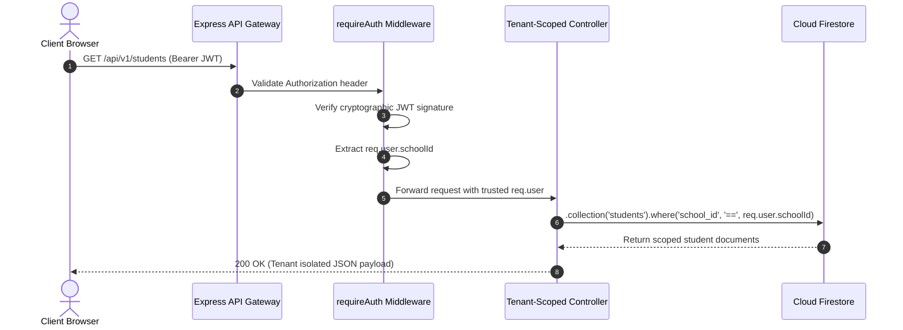

# Multi-Tenant School Data Isolation Specification

## 1. Architectural Foundation & Zero-Leakage Policy

**AttendoSchool** is an institutional Software-as-a-Service (SaaS) platform providing multi-tenant attendance, academic scheduling, guardian communication, and compliance tracking. 

A primary invariant of the system is the **Strict School Data Isolation Guarantee**:
> **At no point shall any data, metadata, identifier, aggregate metric, notification log, or administrative record belonging to School A be readable, writable, inferable, or accessible by any user, administrator, teacher, student, or guardian belonging to School B.**

Any failure of tenant boundaries represents a Severity-0 security defect. The system enforces strict logical data isolation across both storage engines (Firebase Cloud Firestore and PostgreSQL) and within every client-facing API endpoint.

---

## 2. Tenant Context & Request Identity Lifecycle

### 2.1 The Cryptographic Identity Source
Tenant identity is **never accepted from untrusted client input** (such as HTTP request bodies, URL route parameters, or custom client request headers like `X-School-ID`). 

The tenant context is resolved strictly via cryptographically signed JWT tokens issued during authentication:
1. **Client Authentication:** User submits credentials to `POST /api/auth/login`.
2. **Identity Verification:** The backend verifies credentials against the `users` collection / table and identifies the user's assigned `school_id`.
3. **Token Issuance:** An HMAC-SHA256 signed JWT is generated containing:
   ```json
   {
     "userId": "usr_9b1deb4d",
     "schoolId": "sch_01HZX8N6W3PQ",
     "role": "SCHOOL_ADMIN",
     "email": "principal@greenwoodhigh.edu",
     "iat": 1759160000,
     "exp": 1759246400
   }
   ```
4. **Middleware Enforcement (`requireAuth`):**
   - The token is verified against `JWT_SECRET`.
   - The verified payload is bound to `req.user`.
   - `req.user.schoolId` is designated as the immutable source of truth for all subsequent operations.



---

## 3. Storage Layer Isolation Patterns

### 3.1 Cloud Firestore Partitioning Pattern
In Cloud Firestore, all core institutional entities reside in root collections partitioned by the indexed `school_id` property. Every read, write, update, and aggregation query must explicitly scope its query constraint.

```typescript
// SECURE PATTERN: Strictly scoped to verified tenant
const userSchoolId = req.user?.schoolId;
const studentsSnapshot = await collections.students()
  .where('school_id', '==', userSchoolId)
  .where('is_active', '==', true)
  .get();

// AGGREGATION PATTERN: Native count scoped to tenant
const activeStudentsCount = await collections.students()
  .where('school_id', '==', userSchoolId)
  .where('is_active', '==', true)
  .count()
  .get();
```

#### Prohibited Anti-Patterns:
- ❌ **Un-scoped Global Queries:** `collections.students().get()` followed by JavaScript-level filtering `.filter(s => s.school_id === sid)`. This pattern violates security boundaries, incurs catastrophic read billing, and exhausts Firestore quotas.
- ❌ **Client-Supplied School ID Overrides:** `const sid = req.query.schoolId || req.user.schoolId;`. Allows client parameter tampering.

### 3.2 Relational PostgreSQL Partitioning Pattern
When PostgreSQL is utilized (`USE_POSTGRES=true`), row-level security (RLS) and mandatory `WHERE school_id = $1` parameterization are applied:

```sql
-- Secure Parameterized Isolation Query
SELECT 
    s.id, s.admission_number, s.first_name, s.last_name, s.roll_number,
    c.name AS class_name, sec.name AS section_name
FROM students s
INNER JOIN classes c ON s.class_id = c.id AND c.school_id = $1
LEFT JOIN sections sec ON s.section_id = sec.id AND sec.school_id = $1
WHERE s.school_id = $1 AND s.is_active = TRUE;
```

---

## 4. Elimination of Synthetic Fallbacks & The True Zero-Data Rule

### 4.1 The Synthetic Fallback Vulnerability
A common defect in educational software is defaulting to "Demo Data" (e.g. `demoStudents`, `demoTeachers`, or hardcoded attendance trends like `94.2%`) whenever a query returns an empty result set or when a network timeout occurs. 

In AttendoSchool, this defect is completely eliminated:
- If a newly registered school has 0 students enrolled, the response must be `[]`, and the UI displays an empty onboarding state: `"No students enrolled yet. Add your first student."`
- If 0 teachers are registered, the response is `[]`, rendering `"No faculty members found."`
- If 0 attendance records exist for today, the dashboard displays `0%` or `"No attendance marked today"`, never a synthetic placeholder.

### 4.2 Handling Firestore Quota Exceptions
When Firestore quotas are exhausted or transient infrastructure errors occur:
1. The backend must respond with an explicit HTTP 429/503 status:
   ```json
   {
     "error": "SERVICE_UNAVAILABLE",
     "message": "Database quota exceeded or transient error. Retrying...",
     "code": "FIRESTORE_RESOURCE_EXHAUSTED"
   }
   ```
2. The frontend renders an informative institutional alert banner with manual retry controls.
3. The system **never substitutes synthetic mock profiles** during failures.

---

## 5. Insecure Direct Object Reference (IDOR) Defenses

When performing mutations (`PUT`, `PATCH`, `DELETE`) on individual entities by identifier (e.g., `DELETE /api/students/:id`), the backend must verify that the resource exists AND belongs to the calling user's `school_id`:

```typescript
export async function deleteStudentHandler(req: AuthRequest, res: Response) {
  const { id } = req.params;
  const userSchoolId = req.user?.schoolId;

  // Retrieve document reference
  const docRef = collections.students().doc(id);
  const docSnap = await docRef.get();

  if (!docSnap.exists) {
    return res.status(404).json({ error: 'Student not found.' });
  }

  const studentData = docSnap.data();
  // Enforce Tenant Boundary Check
  if (studentData?.school_id !== userSchoolId) {
    console.warn(`[SECURITY ALERT] Cross-tenant deletion attempt by user ${req.user?.id} on resource ${id}`);
    return res.status(403).json({ error: 'ACCESS_DENIED: Resource belongs to another institution.' });
  }

  await docRef.update({
    is_active: false,
    deleted_at: new Date().toISOString(),
    deleted_by: req.user?.id
  });

  return res.json({ success: true, message: 'Student successfully deactivated.' });
}
```

---

## 6. Tenant Partitioning by Resource Matrix

| Resource Entity | Firestore Key | Read Scope | Mutation Scope | Aggregation Scope |
| :--- | :--- | :--- | :--- | :--- |
| **School Profile** | `id` | Own School Only | School Admin (Own School) | Single document |
| **Academic Years** | `school_id` | Own School Active | School Admin | Filtered by `school_id` |
| **Classes & Sections**| `school_id` | Own School | School Admin | Filtered by `school_id` |
| **Faculty Directory** | `school_id` | Own School | School Admin | Filtered by `school_id` |
| **Student Roster** | `school_id` | Assigned / School | School Admin | Filtered by `school_id` |
| **Daily Attendance** | `school_id` | Assigned / School | Faculty / Admin | Filtered by `school_id` + Date |
| **Correction Requests**| `school_id` | Assigned / School | Faculty (Create) / Admin (Approve)| Filtered by `school_id` + Status |
| **Announcements** | `school_id` | Target Audience | Faculty / Admin | Filtered by `school_id` |
| **Guardian Replies** | `school_id` | Associated Notice | Author / Admin | Filtered by `school_id` |

---

## 7. Data Hygiene, Archival & Retention

1. **Soft Deletion:** Institutional entities (students, faculty, classes) utilize soft deletion (`is_active: false`, `archived_at: timestamp`) to preserve historical attendance integrity.
2. **Audit Trails:** All modifications write an immutable log to `audit_logs` storing `school_id`, `actor_id`, `actor_role`, `action`, `resource_id`, and `timestamp`.
3. **Session Purging:** When a school tenant subscription lapses beyond the grace period, data remains read-only for 60 days before scheduled export and archival.
