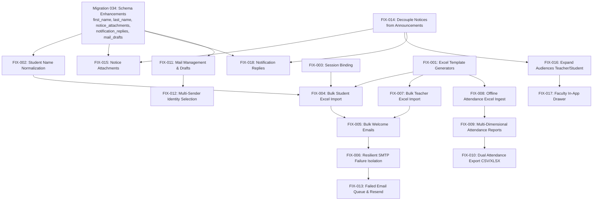
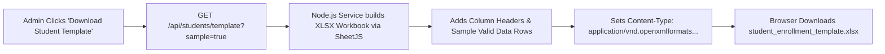
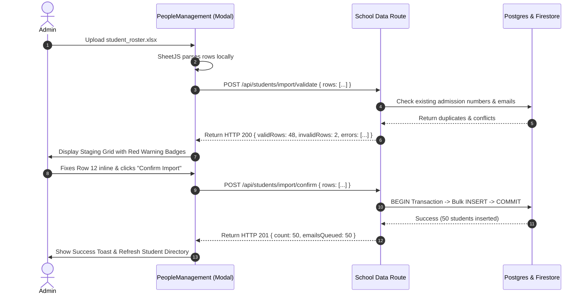
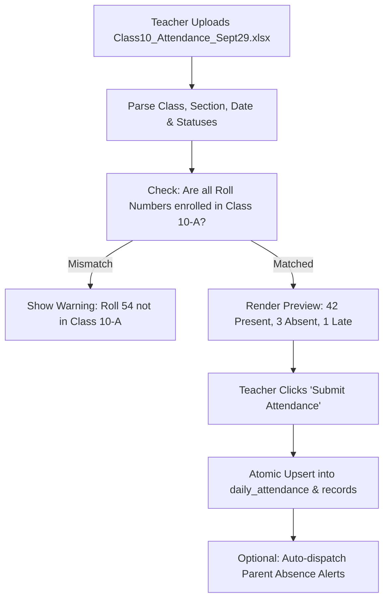
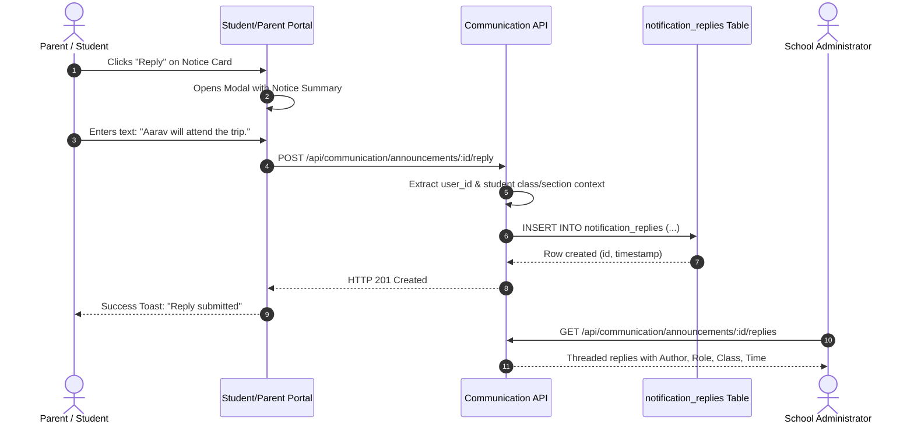

# AttendO School — Task 1 Engineering Fix Specification (`fix1.md`)
## Complete Technical Blueprint, Expected Outputs, Schema Migrations & Flowcharts

---

### Document Control
- **Document Identifier**: `TASK-001-FIXES-v1.0`
- **Product Name**: AttendO School (`school-attendance-saas`)
- **Document Title**: Engineering Fix Blueprint & Expected Outputs Specification
- **Target File**: `fix1.md`
- **Source Specification**: [`task1.md`](file:///d:/Project_Abir/attendoschool/task1.md)
- **Status**: Implementation-Ready Engineering Guide
- **Date**: September 29, 2026

---

## 1. Architectural Fix Dependency Graph



---

## 2. Complete Database Migration Script (`034_task1_enhancements.sql`)

```sql
-- ====================================================================
-- Migration 034: Task-1 Architecture Enhancements
-- File: database/migrations/034_task1_enhancements.sql
-- ====================================================================

-- 1. Student Name Normalization & Session Foreign Key
ALTER TABLE students ADD COLUMN IF NOT EXISTS first_name VARCHAR(100);
ALTER TABLE students ADD COLUMN IF NOT EXISTS last_name VARCHAR(100);
ALTER TABLE students ADD COLUMN IF NOT EXISTS full_name VARCHAR(200);

-- Backfill full_name from existing name column
UPDATE students SET full_name = name WHERE full_name IS NULL;
UPDATE students SET first_name = split_part(name, ' ', 1) WHERE first_name IS NULL;
UPDATE students SET last_name = substr(name, length(split_part(name, ' ', 1)) + 2) WHERE last_name IS NULL AND position(' ' in name) > 0;

-- 2. Notice Multi-File Attachments
CREATE TABLE IF NOT EXISTS notice_attachments (
  id UUID PRIMARY KEY DEFAULT gen_random_uuid(),
  school_id UUID NOT NULL REFERENCES schools(id) ON DELETE CASCADE,
  announcement_id UUID NOT NULL REFERENCES announcements(id) ON DELETE CASCADE,
  file_name VARCHAR(255) NOT NULL,
  file_url TEXT NOT NULL,
  file_type VARCHAR(100),
  file_size_bytes INT,
  created_at TIMESTAMPTZ NOT NULL DEFAULT NOW()
);
CREATE INDEX IF NOT EXISTS idx_notice_attachments_announcement 
  ON notice_attachments(announcement_id);

-- 3. Notification & Notice Replies Subsystem
CREATE TABLE IF NOT EXISTS notification_replies (
  id UUID PRIMARY KEY DEFAULT gen_random_uuid(),
  school_id UUID NOT NULL REFERENCES schools(id) ON DELETE CASCADE,
  announcement_id UUID NOT NULL REFERENCES announcements(id) ON DELETE CASCADE,
  user_id UUID NOT NULL REFERENCES users(id) ON DELETE CASCADE,
  student_id UUID REFERENCES students(id) ON DELETE SET NULL,
  class_id UUID REFERENCES classes(id) ON DELETE SET NULL,
  section_id UUID REFERENCES sections(id) ON DELETE SET NULL,
  reply_text TEXT NOT NULL,
  created_at TIMESTAMPTZ NOT NULL DEFAULT NOW()
);
CREATE INDEX IF NOT EXISTS idx_notification_replies_announcement 
  ON notification_replies(announcement_id, created_at ASC);
CREATE INDEX IF NOT EXISTS idx_notification_replies_user 
  ON notification_replies(user_id);

-- 4. Centralized Mail Drafts & Broadcasts
CREATE TABLE IF NOT EXISTS mail_drafts (
  id UUID PRIMARY KEY DEFAULT gen_random_uuid(),
  school_id UUID NOT NULL REFERENCES schools(id) ON DELETE CASCADE,
  created_by UUID REFERENCES users(id) ON DELETE SET NULL,
  sender_profile VARCHAR(100) NOT NULL DEFAULT 'Administration',
  recipient_type VARCHAR(50) NOT NULL DEFAULT 'INDIVIDUAL',
  target_audience VARCHAR(100),
  subject VARCHAR(255) NOT NULL,
  body_html TEXT NOT NULL,
  created_at TIMESTAMPTZ NOT NULL DEFAULT NOW(),
  updated_at TIMESTAMPTZ NOT NULL DEFAULT NOW()
);
CREATE INDEX IF NOT EXISTS idx_mail_drafts_school_user 
  ON mail_drafts(school_id, created_by, updated_at DESC);
```

---

## 3. Granular Fix Specifications (`FIX-001` to `FIX-018`)

---

### FIX-001: Standardized Student & Teacher Excel Template Downloads
- **Feature ID**: `FEAT-001`, `FEAT-005`
- **Priority**: `P1`
- **Problem**: Administrators have no template files to distribute to staff or prepare offline. Uploads currently fail due to missing or mismatched column headers.
- **Root Cause**: Backend lacks an endpoint streaming dynamic `.xlsx` buffers with validated column definitions.
- **Affected Files**:
  - `backend/src/routes/schoolData.ts`
  - `frontend/src/pages/admin/PeopleManagement.tsx`

#### Architectural Flowchart


#### Required Code Implementation
```typescript
// backend/src/routes/schoolData.ts
import * as XLSX from 'xlsx';

r.get('/students/template', ...admin, (req: AuthRequest, res) => {
  const isSample = req.query.sample === 'true';
  const headers = [
    'First Name*', 'Last Name', 'Admission Number*', 'Roll Number*', 
    'Class Number*', 'Section Name*', 'Parent Name*', 'Parent Phone*', 
    'Parent Email', 'Student Email', 'Login Option (STUDENT/PARENT/NONE)'
  ];
  
  const sampleRows = isSample ? [
    ['Aarav', 'Sharma', 'ADM-2026-001', '01', 10, 'A', 'Rajesh Sharma', '9800011001', 'rajesh@example.com', 'aarav@example.com', 'STUDENT'],
    ['Diya', 'Patel', 'ADM-2026-002', '02', 10, 'A', 'Suresh Patel', '9800011002', 'suresh@example.com', '', 'PARENT'],
    ['Kavita', '', 'ADM-2026-003', '03', 10, 'A', 'Anita Roy', '9800011003', 'anita@example.com', '', 'NONE']
  ] : [];

  const ws = XLSX.utils.aoa_to_sheet([headers, ...sampleRows]);
  ws['!cols'] = headers.map(() => ({ wch: 22 }));
  const wb = XLSX.utils.book_new();
  XLSX.utils.book_append_sheet(wb, ws, 'Student Template');
  const buf = XLSX.write(wb, { type: 'buffer', bookType: 'xlsx' });

  res.setHeader('Content-Type', 'application/vnd.openxmlformats-officedocument.spreadsheetml.sheet');
  res.setHeader('Content-Disposition', 'attachment; filename="student_enrollment_template.xlsx"');
  res.send(buf);
});
```

#### Expected Output
- **HTTP Status**: `200 OK`
- **File Downloaded**: `student_enrollment_template.xlsx` containing valid headers and pre-formatted widths.

---

### FIX-002: Automatic Student Full Name Generation
- **Feature ID**: `FEAT-002`
- **Priority**: `P0`
- **Problem**: Codebase currently accepts a single raw `name` string, causing inconsistencies (e.g. inability to sort by last name, mononym handling issues, and unstandardized casing).
- **Root Cause**: Database and API lack `first_name` and `last_name` split.
- **Affected Files**:
  - `backend/src/routes/schoolData.ts`
  - `database/migrations/034_task1_enhancements.sql`
  - `frontend/src/pages/admin/PeopleManagement.tsx`

#### Expected Logic
$$\text{full\_name} = \begin{cases} \text{firstName.trim()} + \text{" "} + \text{lastName.trim()}, & \text{if lastName exists} \\ \text{firstName.trim()}, & \text{otherwise} \end{cases}$$

#### Expected Output (API Response)
```json
{
  "id": "st-179062999-a1b2",
  "first_name": "Rohan",
  "last_name": "Sharma",
  "full_name": "Rohan Sharma",
  "name": "Rohan Sharma",
  "admission_number": "ADM-2026-001",
  "roll_number": "01",
  "class_number": 10,
  "section_name": "A"
}
```

---

### FIX-003: Mandatory Active Academic Session Binding
- **Feature ID**: `FEAT-003`, `FEAT-058`
- **Priority**: `P0`
- **Problem**: Enrolled students are not linked to `academic_year_id`, making annual cohort roll-overs and historical attendance filtering impossible.
- **Root Cause**: `r.post('/students')` and `/students/bulk-import` omit `academic_year_id` in SQL statements.
- **Affected Files**:
  - `backend/src/routes/schoolData.ts` (lines 464, 532, 664)

#### Remediation SQL
```sql
INSERT INTO students(
  school_id, academic_year_id, class_id, section_id, roll_number, 
  admission_number, first_name, last_name, full_name, name, 
  parent_name, parent_sms_number, email, parent_email, user_id
) VALUES ($1, $2, $3, $4, $5, $6, $7, $8, $9, $10, $11, $12, $13, $14, $15)
```

---

### FIX-004: Bulk Student Excel Import with Dry-Run Validation & Staging Preview
- **Feature ID**: `FEAT-004`, `FEAT-006`, `FEAT-007`
- **Priority**: `P1`
- **Problem**: Bulk import currently accepts raw JSON arrays, failing immediately if invalid without giving administrators a chance to inspect or correct errors.
- **Affected Files**:
  - `backend/src/routes/schoolData.ts`
  - `frontend/src/pages/admin/PeopleManagement.tsx`

#### Architectural Flowchart


#### Expected Preview Payload (API-002 Output)
```json
{
  "totalRows": 2,
  "validCount": 1,
  "invalidCount": 1,
  "preview": [
    {
      "row": 1,
      "firstName": "Rohan",
      "lastName": "Sharma",
      "fullName": "Rohan Sharma",
      "admissionNumber": "ADM-2026-001",
      "status": "VALID",
      "errors": []
    },
    {
      "row": 2,
      "firstName": "Priya",
      "lastName": "Verma",
      "fullName": "Priya Verma",
      "admissionNumber": "ADM-2026-001",
      "status": "INVALID",
      "errors": ["Duplicate admission number 'ADM-2026-001' already exists in this school."]
    }
  ]
}
```

---

### FIX-005: Bulk Welcome Email Dispatcher
- **Feature ID**: `FEAT-010`, `FEAT-018`
- **Priority**: `P1`
- **Problem**: Administrators must manually trigger welcome emails one by one for 100+ students.
- **Affected Files**:
  - `backend/src/routes/schoolData.ts`
  - `backend/src/services/notificationService.ts`

#### Endpoint Specification
- **Method**: `POST /api/students/bulk-email`
- **Request Body**:
  ```json
  {
    "studentIds": ["st-1", "st-2", "st-3"],
    "templateKey": "STUDENT_CREATED"
  }
  ```
- **Response (200 OK)**:
  ```json
  {
    "success": true,
    "totalRequested": 3,
    "enqueued": 3,
    "skippedNoEmail": 0
  }
  ```

---

### FIX-006: Resilient SMTP Failure Isolation & Logging
- **Feature ID**: `FEAT-011`, `FEAT-012`, `FEAT-020`
- **Priority**: `P0`
- **Problem**: If an email delivery fails (e.g. port 587 timeout on Render), the error is swallowed by `console.warn` without writing to `notification_logs`, leaving administrators unaware of delivery failures.
- **Affected Files**:
  - `backend/src/services/notificationService.ts` (lines 1385–1399, 1585–1601)

#### Required Code Implementation
```typescript
// backend/src/services/notificationService.ts
try {
  const info = await transporter.sendMail(mailOptions);
  await pool.query(
    `UPDATE notification_logs SET status='SENT', sent_at=NOW(), provider_message_id=$1 WHERE id=$2`,
    [info.messageId, logId]
  );
} catch (sendErr: any) {
  await pool.query(
    `UPDATE notification_logs SET status='FAILED', failed_at=NOW(), last_error=$1 WHERE id=$2`,
    [sendErr.message, logId]
  );
  // Guarantee primary caller does NOT fail its transaction
  console.error(`[NotificationDelivery] Delivery to ${recipient} failed:`, sendErr.message);
}
```

---

### FIX-007: Bulk Teacher Excel Import Pipeline
- **Feature ID**: `FEAT-015`, `FEAT-016`, `FEAT-017`
- **Priority**: `P1`
- **Problem**: Faculty can only be added individually. Bulk hiring before school terms is tedious.
- **Affected Files**:
  - `backend/src/routes/schoolData.ts`
  - `frontend/src/pages/admin/PeopleManagement.tsx`

#### Template Headers:
`Name*`, `Email*`, `Employee ID*`, `Mobile Phone*`, `Designation`, `Department`

---

### FIX-008: Offline Attendance Excel Ingestion & Preview
- **Feature ID**: `FEAT-021`, `FEAT-022`, `FEAT-023`
- **Priority**: `P1`
- **Problem**: Schools with unreliable daily internet take attendance on paper or Excel and cannot import it.
- **Affected Files**:
  - `backend/src/routes/offlineAttendance.ts`
  - `frontend/src/pages/admin/OfflineAttendance.tsx`

#### Flowchart


---

### FIX-009 & FIX-010: Multi-Dimensional Attendance Reports & Dual Export
- **Feature ID**: `FEAT-027`, `FEAT-030`
- **Priority**: `P1`
- **Problem**: Attendance reports only filter by date, not Class/Section. Export is raw CSV only without Excel formatting.
- **Affected Files**:
  - `backend/src/routes/attendanceReports.ts`
  - `frontend/src/pages/admin/AttendanceReports.tsx`

#### Dual Export Implementation
- `GET /api/attendance-reports/export/csv?from=...&to=...&classId=...&sectionId=...`
- `GET /api/attendance-reports/export/excel?from=...&to=...&classId=...&sectionId=...`

---

### FIX-011 & FIX-013: Centralized Mail Management Hub & Failed Email Resend
- **Feature ID**: `FEAT-031`, `FEAT-033`, `FEAT-034`, `FEAT-038`
- **Priority**: `P1`
- **Problem**: Administrators cannot broadcast custom emails, save drafts, or retry failed deliveries.
- **Affected Files**:
  - `backend/src/routes/mail.ts` *(New File)*
  - `frontend/src/pages/admin/MailManagement.tsx` *(New File)*

#### UI Layout Mockup
```
┌────────────────────────────────────────────────────────────────────────┐
│  CENTRALIZED MAIL MANAGEMENT HUB                                      │
├────────────────────────────────────────────────────────────────────────┤
│  [Compose Email]  [Sent History (142)]  [Drafts (2)]  [Failed (4) ⚠️]   │
├────────────────────────────────────────────────────────────────────────┤
│  FAILED EMAIL QUEUE                                                    │
│  Showing 4 failed deliveries due to SMTP timeout                      │
│                                                                        │
│  [Select All]  [ 🔁 Resend All Failed (4) ]                            │
│                                                                        │
│  [x] Mohan Sharma   | mohan@gmail.com  | Parent Alert | Port 587 ETIMEDOUT │
│  [x] Sunita Roy     | sunita@gmail.com | Term Notice  | Port 587 ETIMEDOUT │
└────────────────────────────────────────────────────────────────────────┘
```

---

### FIX-014 & FIX-015: Notice Management with Multi-File Attachments
- **Feature ID**: `FEAT-039`, `FEAT-040`, `FEAT-041`
- **Priority**: `P1`
- **Problem**: Notices are mixed with announcements and cannot contain file attachments (circulars, syllabi, permission slips).
- **Affected Files**:
  - `backend/src/routes/communication.ts`
  - `database/migrations/034_task1_enhancements.sql`

#### Upload Route Specification
- **Method**: `POST /api/communication/notices`
- **Form Data**:
  - `title`: "Final Term Exam Syllabus"
  - `message`: "Attached is the complete syllabus for grades 5 through 12."
  - `audienceType`: "SCHOOL"
  - `attachments`: `[File, File]` (Multer accepts up to 5 files $\le 10\text{MB}$)

---

### FIX-016 & FIX-017: Expanded Audiences (`TEACHER`, `STUDENT`) & Faculty Drawer
- **Feature ID**: `FEAT-045`, `FEAT-046`, `FEAT-050`
- **Priority**: `P0`
- **Problem**: `communicationService.ts` line 6 strictly throws `Invalid audience` if `audienceType` is not in `['SCHOOL','CLASS','SECTION','PARENTS']`. Teachers and students cannot receive targeted communications.
- **Remediation**:
  ```typescript
  // backend/src/services/communicationService.ts
  const allowed = ['SCHOOL', 'CLASS', 'SECTION', 'PARENTS', 'TEACHER', 'STUDENT'];
  if (!allowed.includes(audience)) throw new Error('Invalid audience type');
  ```

---

### FIX-018: Bidirectional Notification & Notice Reply Subsystem
- **Feature ID**: `FEAT-053` to `FEAT-057`, `FEAT-064`
- **Priority**: `P0`
- **Problem**: No interactive feedback channel exists. Parents and students cannot reply to school notices.
- **Affected Files**:
  - `backend/src/routes/communication.ts`
  - `database/migrations/034_task1_enhancements.sql`
  - `frontend/src/pages/parent/ParentPortal.tsx`
  - `frontend/src/pages/student/StudentDashboard.tsx`
  - `frontend/src/pages/admin/Communication.tsx`

#### Sequence Diagram


---

*End of Engineering Fix Specification (`fix1.md`).*
