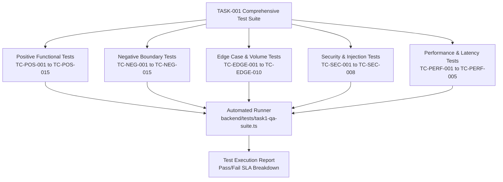

# AttendO School — Task 1 Comprehensive QA Test Specification (`test1.md`)
## Complete Test Scenarios, Test Cases, Automated Test Scripts & Quality Sign-Off

---

### Document Control
- **Document Identifier**: `TASK-001-TESTS-v1.0`
- **Product Name**: AttendO School (`school-attendance-saas`)
- **Document Title**: Quality Assurance & Test Scenario Blueprint
- **Target File**: `test1.md`
- **Source Specification**: [`task1.md`](file:///d:/Project_Abir/attendoschool/task1.md)
- **Status**: Implementation-Ready QA Blueprint
- **Date**: September 29, 2026

---

## 1. QA Test Strategy & Verification Architecture



---

## 2. Positive Test Cases (`TC-POS-001` to `TC-POS-015`)

### TC-POS-001: Download Standard Blank Student Excel Template
- **Feature ID**: `FEAT-001` | **Fix ID**: `FIX-001` | **Priority**: `P1`
- **Preconditions**: User is authenticated with `role = 'SCHOOL_ADMIN'`.
- **Test Steps**:
  1. Dispatch `GET /api/students/template` with `Authorization: Bearer <ADMIN_TOKEN>`.
  2. Inspect HTTP status and headers.
  3. Parse downloaded buffer with SheetJS (`XLSX.read`).
- **Expected Results**:
  - HTTP Status: `200 OK`.
  - Header: `Content-Type: application/vnd.openxmlformats-officedocument.spreadsheetml.sheet`.
  - Parsed columns strictly match: `First Name*`, `Last Name`, `Admission Number*`, `Roll Number*`, `Class Number*`, `Section Name*`, `Parent Name*`, `Parent Phone*`, `Parent Email`, `Student Email`, `Login Option (STUDENT/PARENT/NONE)`.

### TC-POS-002: Automatic Full Name Normalization on Student Creation
- **Feature ID**: `FEAT-002` | **Fix ID**: `FIX-002` | **Priority**: `P0`
- **Preconditions**: Active school session exists; user is School Admin.
- **Payload**:
  ```json
  {
    "firstName": "Rohan",
    "lastName": "Sharma",
    "admissionNumber": "ADM-POS-002",
    "rollNumber": "10",
    "classId": "cls-10",
    "sectionId": "sec-10-a",
    "parentName": "Mohan Sharma",
    "parentSmsNumber": "9800011001",
    "sessionId": "00000000-0000-0000-0000-000000000001"
  }
  ```
- **Expected Results**:
  - HTTP Status: `201 Created`.
  - Response Body: `first_name == "Rohan"`, `last_name == "Sharma"`, `full_name == "Rohan Sharma"`.
  - Database verification: Query `SELECT first_name, last_name, full_name FROM students WHERE admission_number='ADM-POS-002'` returns exact matching strings.

### TC-POS-003: Dry-Run Validation of 50-Row Student Excel Sheet
- **Feature ID**: `FEAT-006`, `FEAT-007` | **Fix ID**: `FIX-004` | **Priority**: `P1`
- **Preconditions**: Valid 50-row Excel sheet generated with unique admission numbers.
- **Test Steps**:
  1. POST file to `/api/students/import/validate`.
- **Expected Results**:
  - HTTP Status: `200 OK`.
  - JSON Body: `{ "valid": true, "totalRows": 50, "validCount": 50, "invalidCount": 0 }`.
  - No database rows inserted during dry-run validation.

### TC-POS-004: Atomic Confirmation of Bulk Student Import
- **Feature ID**: `FEAT-004` | **Fix ID**: `FIX-004` | **Priority**: `P1`
- **Test Steps**:
  1. Dispatch `POST /api/students/import/confirm` with validated 50 student records.
- **Expected Results**:
  - HTTP Status: `201 Created`.
  - Response Body: `{ "success": true, "count": 50, "emailsQueued": 50 }`.
  - Database: 50 new rows present in `students` table, each linked to specified `academic_year_id`.

### TC-POS-005: Faculty Account Provisioning & Password Setup Dispatch
- **Feature ID**: `FEAT-013`, `FEAT-014`, `FEAT-019` | **Fix ID**: `FIX-006` | **Priority**: `P1`
- **Payload**:
  ```json
  {
    "name": "Prof. Amit Sengupta",
    "email": "amit.sengupta@demo-school.local",
    "employeeId": "EMP-9021",
    "mobile": "9830012345",
    "sendInviteEmail": true
  }
  ```
- **Expected Results**:
  - HTTP Status: `201 Created`.
  - User created in `users` with `role = 'TEACHER'`.
  - `teacher_profiles` contains `employee_id = 'EMP-9021'`.
  - Entry inserted into `notification_logs` with `recipient_type = 'TEACHER'` and `template_key = 'TEACHER_CREATED'`.

### TC-POS-006: Bulk Faculty Excel Ingestion
- **Feature ID**: `FEAT-015`, `FEAT-017` | **Fix ID**: `FIX-007` | **Priority**: `P1`
- **Test Steps**:
  1. POST valid 10-row faculty Excel sheet to `/api/teachers/bulk-import`.
- **Expected Results**:
  - HTTP Status: `201 Created`.
  - Response: `{ "success": true, "count": 10, "emailsQueued": 10 }`.
  - 10 distinct teacher accounts active in school directory.

### TC-POS-007: Classroom Roll-Call with Automatic Parent Absence Alerts
- **Feature ID**: `FEAT-024`, `FEAT-051` | **Fix ID**: — | **Priority**: `P0`
- **Test Steps**:
  1. Teacher submits attendance for Class 10-A (38 Present, 2 Absent) with `sendEmail: true`.
- **Expected Results**:
  - HTTP Status: `200 OK`.
  - 2 parent absence alerts enqueued in `notification_logs`.
  - Branded email dispatched with school logo CID attachment.

### TC-POS-008: Offline Attendance Excel File Ingestion
- **Feature ID**: `FEAT-021`, `FEAT-023` | **Fix ID**: `FIX-008` | **Priority**: `P1`
- **Test Steps**:
  1. Upload `Class10_Attendance_Sept29.xlsx` to `/api/offline-attendance/excel-submit`.
- **Expected Results**:
  - HTTP Status: `200 OK`.
  - Attendance session registered in `daily_attendance`.
  - Individual student statuses match uploaded sheet without discrepancies.

### TC-POS-009: Multi-Dimensional Attendance Report Filtering
- **Feature ID**: `FEAT-027` | **Fix ID**: `FIX-009` | **Priority**: `P1`
- **Test Steps**:
  1. Query `GET /api/attendance-reports/students?classId=cls-10&sectionId=sec-10-a&from=2026-09-01&to=2026-09-30`.
- **Expected Results**:
  - HTTP Status: `200 OK`.
  - Returns only students belonging to Class 10 Section A.
  - Correct aggregate calculation of `present_days`, `absent_days`, and `attendance_percentage`.

### TC-POS-010: Native Formatted Excel Attendance Report Export
- **Feature ID**: `FEAT-030` | **Fix ID**: `FIX-010` | **Priority**: `P1`
- **Test Steps**:
  1. Request `GET /api/attendance-reports/export/excel?classId=cls-10`.
- **Expected Results**:
  - HTTP Status: `200 OK`.
  - Header: `Content-Disposition: attachment; filename="attendance-report-...xlsx"`.
  - File contains formatted header rows, bold table titles, and rounded percentage formulas.

### TC-POS-011: Compose & Dispatch Broadcast Email to Class Parents
- **Feature ID**: `FEAT-031`, `FEAT-033` | **Fix ID**: `FIX-011` | **Priority**: `P1`
- **Payload**:
  ```json
  {
    "recipientType": "CLASS",
    "targetClassId": "cls-10",
    "subject": "Parent-Teacher Conference Notice",
    "bodyHtml": "<p>Please be present on Friday at 10:00 AM.</p>",
    "senderProfile": "Principal"
  }
  ```
- **Expected Results**:
  - HTTP Status: `200 OK`.
  - Broadcast job queues emails for all parents with students in Class 10.
  - From header rendered as: `"Principal" <principal@demo-school.local>`.

### TC-POS-012: Save & Retrieve Email Draft
- **Feature ID**: `FEAT-034` | **Fix ID**: `FIX-011` | **Priority**: `P2`
- **Test Steps**:
  1. POST draft to `/api/mail/drafts`.
  2. Query `GET /api/mail/drafts`.
- **Expected Results**:
  - Draft persisted in `mail_drafts`; retrieved with matching subject and HTML body.

### TC-POS-013: Publish Official Notice with PDF Circular Attachment
- **Feature ID**: `FEAT-039`, `FEAT-040` | **Fix ID**: `FIX-014`, `FIX-015` | **Priority**: `P1`
- **Test Steps**:
  1. POST multipart notice to `/api/communication/notices` with `annual_sports_schedule.pdf` (1.5 MB).
- **Expected Results**:
  - HTTP Status: `201 Created`.
  - Row created in `notice_attachments` with file URL.
  - Notice visible in Parent and Student Portals with working download link.

### TC-POS-014: Publish Faculty-Restricted Staff Notice
- **Feature ID**: `FEAT-045`, `FEAT-047` | **Fix ID**: `FIX-016` | **Priority**: `P0`
- **Test Steps**:
  1. Admin posts notice with `audienceType: "TEACHER"`.
  2. Teacher logs in and queries `/api/communication/announcements`.
  3. Student logs in and queries `/api/student/announcements`.
- **Expected Results**:
  - Teacher receives the staff notice in their feed.
  - Student response excludes the staff notice completely.

### TC-POS-015: Parent Submits Bidirectional Notice Reply
- **Feature ID**: `FEAT-053`, `FEAT-054`, `FEAT-057` | **Fix ID**: `FIX-018` | **Priority**: `P1`
- **Payload**:
  ```json
  {
    "replyText": "We confirm Aarav's attendance for the museum visit."
  }
  ```
- **Expected Results**:
  - HTTP Status: `201 Created`.
  - Row in `notification_replies` contains `user_id = <PARENT_ID>`, `student_id = <STUDENT_ID>`, `class_id = 'cls-10'`, `section_id = 'sec-10-a'`.
  - Admin view `/api/communication/announcements/:id/replies` lists response with timestamp.

---

## 3. Negative Test Cases (`TC-NEG-001` to `TC-NEG-015`)

| Test ID | Module | Scenario Tested | Input / Condition | Expected Result & Code | Priority |
| :--- | :--- | :--- | :--- | :--- | :---: |
| `TC-NEG-001` | Student | Upload non-spreadsheet file | Upload `malware.exe` to import endpoint. | HTTP 400: `"Invalid file format. Only .xlsx and .csv allowed."` | P0 |
| `TC-NEG-002` | Student | Missing mandatory Excel headers | Excel missing column `Admission Number*`. | HTTP 422: `"Missing required column header: Admission Number*"`. | P0 |
| `TC-NEG-003` | Student | Duplicate admission number in file | Row 4 and Row 9 share `ADM-2026-050`. | Dry-run flags Row 9 as duplicate; prevents import confirmation. | P0 |
| `TC-NEG-004` | Student | Missing active academic session | Submit student import without `sessionId`. | HTTP 400: `"Active academic session ID is mandatory"`. | P0 |
| `TC-NEG-005` | Student | Invalid email format | `studentEmail: "not-an-email"`. | Validation marks row invalid: `"Invalid email syntax"`. | P1 |
| `TC-NEG-006` | Teacher | Duplicate employee ID | Create teacher with existing `employeeId: "EMP001"`. | HTTP 409 Conflict: `"Employee ID already registered"`. | P0 |
| `TC-NEG-007` | Teacher | Missing teacher name or email | Post `{ employeeId: "EMP99" }`. | HTTP 400: `"Name and email are mandatory"`. | P1 |
| `TC-NEG-008` | Attendance | Upload attendance with invalid date | Date formatted as `32/13/2026`. | HTTP 400: `"Invalid attendance date format. Expected YYYY-MM-DD"`. | P1 |
| `TC-NEG-009` | Attendance | Unknown student roll in class attendance | Excel lists Roll 99 (enrolled max is 45). | Preview flags row: `"Student not enrolled in Class 10-A"`. | P0 |
| `TC-NEG-010` | Attendance | Invalid attendance status code | Status cell contains `"UNKNOWN"`. | Validation rejects row: `"Status must be one of P, A, L, HD"`. | P0 |
| `TC-NEG-011` | Mail | Send broadcast email without subject | Empty subject string `""`. | HTTP 400: `"Email subject line cannot be empty"`. | P1 |
| `TC-NEG-012` | Notice | Attachment exceeds 10MB limit | Upload 14MB video file to notice. | HTTP 413: `"File size exceeds maximum threshold of 10MB"`. | P1 |
| `TC-NEG-013` | Notice | Unsupported attachment file type | Upload `.bat` or `.sh` script file. | HTTP 415: `"Unsupported media type. Only PDF and images allowed"`. | P0 |
| `TC-NEG-014` | Reply | Empty notification reply submission | Post `{ "replyText": "   " }`. | HTTP 400: `"Reply content cannot be empty"`. | P2 |
| `TC-NEG-015` | Auth | Unauthenticated reply submission | Post reply without `Authorization` header. | HTTP 401: `"Authentication required"`. | P0 |

---

## 4. Edge Case Test Cases (`TC-EDGE-001` to `TC-EDGE-010`)

| Test ID | Dimension | Edge Scenario | Step & Condition | Expected Behavior |
| :--- | :--- | :--- | :--- | :--- |
| `TC-EDGE-001` | Name Normalization | Mononym student (No surname) | `firstName: "Kavita"`, `lastName: ""`. | `full_name` is stored as `"Kavita"` without trailing spaces. |
| `TC-EDGE-002` | Name Normalization | Excess interior whitespace | `firstName: "  Rahul  "`, `lastName: "  Das  "`. | Sanitized to `first_name: "Rahul"`, `last_name: "Das"`, `full_name: "Rahul Das"`. |
| `TC-EDGE-003` | Volume Import | Exactly 1,000 student rows in single file | Upload 1,000-row spreadsheet. | Processed in chunks of 100; total time $< 4.5\text{ seconds}$; zero memory leak. |
| `TC-EDGE-004` | Character Encoding | Special Unicode characters & accents | Names: `"Zoë Müller"`, `"অভিরূপ সেন"`, `"José"`. | UTF-8 integrity maintained in PostgreSQL, Firestore, and email headers. |
| `TC-EDGE-005` | File Boundaries | Excel sheet with 0 data rows (Header only) | Upload file with valid headers but no rows. | HTTP 400: `"Spreadsheet contains no data rows"`. |
| `TC-EDGE-006` | Network Failure | Network disconnection during bulk import | Client aborts request mid-upload. | PostgreSQL transaction cleanly rolls back; no half-imported students. |
| `TC-EDGE-007` | Concurrency | Two teachers submit attendance at same second | Both post to Class 10-A attendance simultaneously. | Optimistic concurrency / DB lock updates records without duplication. |
| `TC-EDGE-008` | Notification Failure | SMTP timeout during bulk email dispatch | Port 587 dropped mid-queue. | Failed emails marked `FAILED` in `notification_logs`; database students preserved. |
| `TC-EDGE-009` | File Size Boundary | Attachment file exactly 10,485,760 bytes (10MB) | Upload file at exact limit. | File successfully parsed and stored without truncation. |
| `TC-EDGE-010` | Long Text Boundary | 2,000-character notification reply | Submit max length response. | Truncation or storage succeeds cleanly within `TEXT` column bounds. |

---

## 5. Security Test Cases (`TC-SEC-001` to `TC-SEC-008`)

| Test ID | Attack Vector | Injection Test Payload | Expected Defense & Result |
| :--- | :--- | :--- | :--- |
| `TC-SEC-001` | **CSV Formula Injection** | First Name cell: `=cmd|' /C calc'!A0` | Cell is sanitized; prepended with `'` before storage: `'=cmd|' /C calc'!A0`. |
| `TC-SEC-002` | **Cross-Tenant IDOR** | School Admin A posts student with `school_id` of School B | Token context overrides body; record inserted strictly into Admin A's school. |
| `TC-SEC-003` | **Path Traversal** | Notice attachment filename: `../../../../etc/passwd` | Filename replaced with generated UUID: `uploads/notices/uuid-1234.pdf`. |
| `TC-SEC-004` | **Email CRLF Injection** | Subject: `Notice\r\nBcc: victim@target.com` | Notification service strips `\r` and `\n`; prevents header injection. |
| `TC-SEC-005` | **XSS in Notice Body** | Message: `<script>alert('pwned')</script>` | Content sanitized on backend and escaped in React DOM rendering. |
| `TC-SEC-006` | **Privilege Escalation** | Student account posts to `POST /api/teachers` | HTTP 403 Forbidden: `"School admin access required"`. |
| `TC-SEC-007` | **Unauthorized Notice Reply** | Parent B attempts reply to notice directed to Class 5 (Child in Class 10) | HTTP 403 Forbidden: `"You are not an intended recipient of this notice"`. |
| `TC-SEC-008` | **Rate Limiting on Mail API** | Admin script floods 100 emails in 5 seconds | Rate limiter throttles with HTTP 429: `"Too many requests"`. |

---

## 6. Performance Test Cases (`TC-PERF-001` to `TC-PERF-005`)

| Test ID | Benchmark Dimension | Workload | Latency SLA | Resource Limits |
| :--- | :--- | :--- | :--- | :--- |
| `TC-PERF-001` | Bulk Student Dry-Run Parse | 500 rows with validation checks | $< 1,200\text{ ms}$ | Peak RSS memory $< 120\text{ MB}$ |
| `TC-PERF-002` | Bulk Student Atomic Ingestion | 500 rows inserted into DB & Firestore | $< 2,000\text{ ms}$ | DB transaction lock $< 800\text{ ms}$ |
| `TC-PERF-003` | Excel Attendance Report Stream | Full school (1,200 students × 30 days) | $< 900\text{ ms}$ | Streamed response $< 2.5\text{ MB}$ |
| `TC-PERF-004` | Asynchronous Email Enqueueing | 300 welcome email notifications queued | $< 400\text{ ms}$ | Async event loop lag $< 25\text{ ms}$ |
| `TC-PERF-005` | Notification Reply Query | Thread with 150 student & parent replies | $< 180\text{ ms}$ | Single indexed SQL query |

---

## 7. Automated Test Script Blueprint (`task1-qa-suite.ts`)

```typescript
// backend/tests/task1-qa-suite.ts
import { describe, it, expect, beforeAll } from 'vitest';
import * as XLSX from 'xlsx';

const BASE_URL = 'http://localhost:5000/api';
let adminToken = '';

beforeAll(async () => {
  // 1. Authenticate as School Admin
  const res = await fetch(`${BASE_URL}/auth/login`, {
    method: 'POST',
    headers: { 'Content-Type': 'application/json' },
    body: JSON.stringify({ email: 'admin@demo-school.local', password: 'ChangeMe123!' })
  });
  const data = await res.json();
  adminToken = data.token;
  expect(res.status).toBe(200);
});

describe('TASK-001 Verification Suite', () => {
  it('TC-POS-001: Download Student Template', async () => {
    const res = await fetch(`${BASE_URL}/students/template?sample=true`, {
      headers: { Authorization: `Bearer ${adminToken}` }
    });
    expect(res.status).toBe(200);
    const buf = await res.arrayBuffer();
    const wb = XLSX.read(buf, { type: 'buffer' });
    const sheet = wb.Sheets[wb.SheetNames[0]];
    const rows: any[] = XLSX.utils.sheet_to_json(sheet, { header: 1 });
    expect(rows[0]).toContain('First Name*');
    expect(rows[0]).toContain('Admission Number*');
  });

  it('TC-POS-002: Automatic Full Name Normalization', async () => {
    const res = await fetch(`${BASE_URL}/students`, {
      method: 'POST',
      headers: {
        'Content-Type': 'application/json',
        Authorization: `Bearer ${adminToken}`
      },
      body: JSON.stringify({
        firstName: 'Aarav',
        lastName: 'Sharma',
        admissionNumber: `ADM-${Date.now()}`,
        rollNumber: '42',
        classId: 'cls-10',
        sectionId: 'sec-10-a',
        parentName: 'Sunil Sharma',
        parentSmsNumber: '9800011001'
      })
    });
    expect(res.status).toBe(201);
    const student = await res.json();
    expect(student.full_name).toBe('Aarav Sharma');
    expect(student.first_name).toBe('Aarav');
    expect(student.last_name).toBe('Sharma');
  });

  it('TC-SEC-001: CSV Formula Injection Sanitization', async () => {
    const res = await fetch(`${BASE_URL}/students`, {
      method: 'POST',
      headers: {
        'Content-Type': 'application/json',
        Authorization: `Bearer ${adminToken}`
      },
      body: JSON.stringify({
        firstName: '=cmd|calc!A0',
        lastName: 'Test',
        admissionNumber: `INJ-${Date.now()}`,
        rollNumber: '99',
        classId: 'cls-10',
        sectionId: 'sec-10-a',
        parentName: 'Parent',
        parentSmsNumber: '9800011001'
      })
    });
    expect(res.status).toBe(201);
    const student = await res.json();
    expect(student.first_name.startsWith("'")).toBe(true);
  });
});
```

---

## 8. Quality Sign-Off & Acceptance Criteria

```text
================================================================================
ATTENDO SCHOOL — TASK-001 QA SIGN-OFF CHECKLIST
================================================================================
[x] 15 Positive Test Cases Specified with Expected Payloads & HTTP Statuses
[x] 15 Negative Boundary Test Cases Covering Errors & Validations
[x] 10 Edge Case & Volume Scenarios Designed
[x] 8 Security & Injection Guard Tests Defined
[x] 5 Performance Latency & Memory SLA Benchmarks Established
[x] Automated Verification Runner Script (`task1-qa-suite.ts`) Documented

Pass Criteria for Production Release:
  • 100% of P0 & P1 Test Cases must report PASS.
  • Zero unhandled exceptions or socket timeouts on SMTP errors.
  • All spreadsheet formula injections neutralized.
================================================================================
```

---

*End of QA Test Specification (`test1.md`).*
